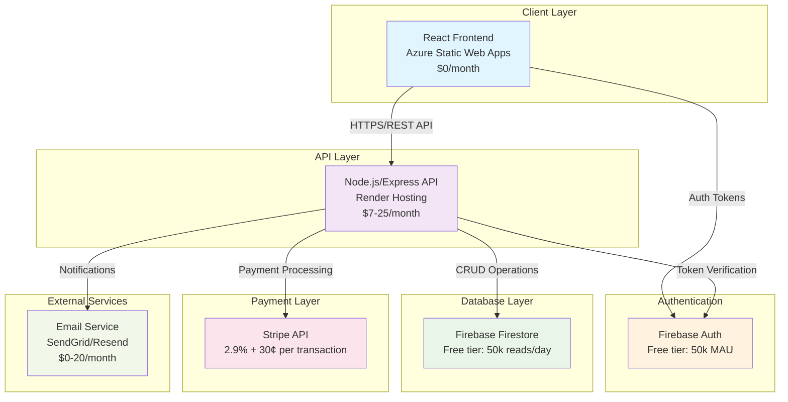
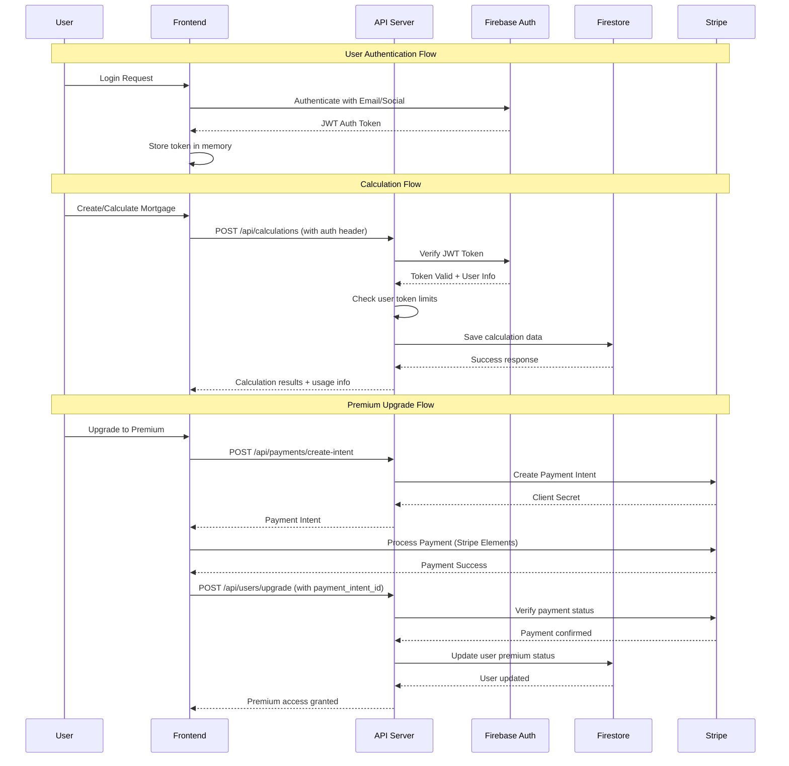

# Architecture Decision Document
## Full-Stack Transformation: Mortgage Calculator

### Executive Summary

This document outlines the architectural decisions for transforming the existing front-end-only mortgage calculator into a scalable, maintainable full-stack application with user authentication, payment processing, and premium features.

### Current State Analysis

**Existing Architecture:**
- **Frontend**: React/TypeScript SPA with Vite build system
- **Calculations**: Complex mortgage calculation engine (client-side only)
- **Storage**: localStorage for saved calculations
- **Hosting**: Azure Static Web Apps (static hosting)
- **Dependencies**: Firebase already included but unused

**Limitations:**
- No user management or authentication
- No data persistence across devices
- No premium feature gating
- No payment processing capabilities
- No usage analytics or monitoring
- Limited scalability for future features

### Architectural Decisions

#### 1. Technology Stack Selection

**Frontend (No Changes)**
- **Technology**: React 18 + TypeScript + Vite
- **Rationale**: Existing codebase is well-structured and performant
- **UI Library**: Radix UI + Tailwind CSS (already implemented)

**Backend**
- **Technology**: Node.js + Express + TypeScript
- **Rationale**: 
  - Leverages existing TypeScript expertise
  - Excellent ecosystem for rapid development
  - Easy integration with Firebase services
  - Cost-effective hosting options

**Database & Authentication**
- **Technology**: Firebase (Firestore + Auth)
- **Rationale**:
  - Already included as dependency
  - Excellent authentication system with social logins
  - NoSQL flexibility for evolving data models
  - Built-in security rules
  - Generous free tier

**Payment Processing**
- **Technology**: Stripe
- **Rationale**:
  - Industry standard with excellent documentation
  - Comprehensive webhook system
  - Built-in customer portal
  - PCI compliance handled automatically
  - Competitive pricing (2.9% + 30¢)

#### 2. Hosting Strategy

**Frontend Hosting**
- **Technology**: Azure Static Web Apps (existing)
- **Cost**: $0/month (free tier)
- **Rationale**: Already configured and working well

**Backend Hosting**
- **Technology**: Render
- **Cost**: $7-25/month
- **Rationale**:
  - 50-75% cost savings vs Azure App Service
  - Excellent Node.js support
  - Automatic deployments from Git
  - Built-in SSL and monitoring
  - Easy environment variable management

**Cost Comparison:**
| Service | Azure App Service | Render | Savings |
|---------|------------------|--------|---------|
| Basic Tier | $13/month | $7/month | $6/month (46%) |
| Standard Tier | $56/month | $25/month | $31/month (55%) |

#### 3. Architecture Overview



#### 4. Data Flow Architecture



#### 5. Database Schema Design

**Users Collection (`users/{uid}`)**
```typescript
interface User {
  uid: string;                    // Firebase Auth UID
  email: string;                  // User email
  displayName?: string;           // Optional display name
  photoURL?: string;              // Profile picture URL
  isPremium: boolean;             // Premium subscription status
  premiumExpiresAt?: Timestamp;   // Premium expiration date
  stripeCustomerId?: string;      // Stripe customer ID
  tokensUsed: number;             // API calls made this month
  tokensLimit: number;            // Monthly token limit
  resetDate: Timestamp;           // When tokens reset
  createdAt: Timestamp;           // Account creation date
  updatedAt: Timestamp;           // Last update
  preferences: {                  // User preferences
    currency: string;
    language: string;
    emailNotifications: boolean;
  };
}
```

**Calculations Collection (`calculations/{id}`)**
```typescript
interface SavedCalculation {
  id: string;                     // Document ID
  userId: string;                 // Owner's UID
  name: string;                   // User-defined name
  loanDetails: {                  // Input parameters
    principal: number;
    interestRatePeriods: Array<{
      startMonth: number;
      interestRate: number;
    }>;
    loanTerm: number;
    overpaymentPlans: OverpaymentDetails[];
    startDate: Timestamp;
    repaymentModel: 'equalInstallments' | 'decreasingInstallments';
    additionalCosts?: AdditionalCosts;
  };
  results: CalculationResults;    // Computed results
  isPublic: boolean;              // Shareable calculation
  shareToken?: string;            // Public sharing token
  tags: string[];                 // User-defined tags
  createdAt: Timestamp;
  updatedAt: Timestamp;
}
```

**Payments Collection (`payments/{id}`)**
```typescript
interface Payment {
  id: string;                     // Document ID
  userId: string;                 // Payer's UID
  stripePaymentIntentId: string;  // Stripe payment intent ID
  stripeCustomerId: string;       // Stripe customer ID
  amount: number;                 // Amount in cents
  currency: string;               // Currency code (USD, EUR, etc.)
  status: 'pending' | 'succeeded' | 'failed' | 'canceled';
  planType: 'monthly' | 'yearly'; // Subscription type
  metadata: {                     // Additional payment info
    planName: string;
    tokenLimit: number;
  };
  createdAt: Timestamp;
  processedAt?: Timestamp;
}
```

**Feature Flags Collection (`featureFlags/{flagKey}`)**
```typescript
interface FeatureFlag {
  key: string;                    // Feature identifier
  enabled: boolean;               // Global enable/disable
  premiumOnly: boolean;           // Requires premium subscription
  description: string;            // Feature description
  rolloutPercentage: number;      // Gradual rollout (0-100)
  targetUsers?: string[];         // Specific user targeting
  createdAt: Timestamp;
  updatedAt: Timestamp;
}
```

#### 6. API Design

**Authentication Endpoints**
```typescript
POST   /api/auth/verify          // Verify Firebase token
GET    /api/auth/user            // Get current user info
POST   /api/auth/refresh         // Refresh user data
DELETE /api/auth/logout          // Logout (cleanup)
```

**User Management Endpoints**
```typescript
GET    /api/users/profile        // Get user profile
PUT    /api/users/profile        // Update user profile
POST   /api/users/upgrade        // Upgrade to premium
GET    /api/users/usage          // Get token usage stats
POST   /api/users/reset-tokens   // Reset monthly tokens (admin)
```

**Calculation Endpoints**
```typescript
GET    /api/calculations         // List user's calculations
POST   /api/calculations         // Create new calculation
GET    /api/calculations/:id     // Get specific calculation
PUT    /api/calculations/:id     // Update calculation
DELETE /api/calculations/:id     // Delete calculation
POST   /api/calculations/calculate // Perform calculation (consumes token)
GET    /api/calculations/public/:shareToken // Get public calculation
```

**Payment Endpoints**
```typescript
POST   /api/payments/create-intent    // Create Stripe payment intent
POST   /api/payments/webhook          // Stripe webhook handler
GET    /api/payments/history          // User's payment history
POST   /api/payments/cancel-subscription // Cancel subscription
GET    /api/payments/customer-portal  // Stripe customer portal URL
```

**Feature Management Endpoints**
```typescript
GET    /api/features              // Get available features for user
GET    /api/features/:key         // Get specific feature status
PUT    /api/features/:key         // Update feature flag (admin)
```

#### 7. Security Considerations

**Authentication & Authorization**
- Firebase Auth JWT token verification on all protected endpoints
- Role-based access control (free vs premium users)
- API rate limiting per user tier (10 requests/hour free, 1000/hour premium)
- Token expiration and refresh handling

**Data Protection**
- Input validation using Zod schemas
- SQL injection prevention (NoSQL, but still validate inputs)
- XSS protection with proper CORS configuration
- Firestore security rules for data access control

**Payment Security**
- Stripe webhook signature verification
- PCI compliance through Stripe (no card data stored)
- Secure payment intent handling
- Customer data encryption at rest

**API Security**
```typescript
// Example middleware stack
app.use(helmet());                    // Security headers
app.use(cors(corsOptions));          // CORS configuration
app.use(rateLimit(rateLimitOptions)); // Rate limiting
app.use(validateFirebaseToken);       // Auth verification
app.use(checkUserLimits);            // Usage limits
```

**Firestore Security Rules**
```javascript
rules_version = '2';
service cloud.firestore {
  match /databases/{database}/documents {
    // Users can only access their own data
    match /users/{userId} {
      allow read, write: if request.auth != null && request.auth.uid == userId;
    }
    
    // Calculations are private to users
    match /calculations/{calculationId} {
      allow read, write: if request.auth != null && 
        request.auth.uid == resource.data.userId;
      allow read: if resource.data.isPublic == true;
    }
    
    // Payments are read-only for users
    match /payments/{paymentId} {
      allow read: if request.auth != null && 
        request.auth.uid == resource.data.userId;
    }
    
    // Feature flags are read-only for all authenticated users
    match /featureFlags/{flagId} {
      allow read: if request.auth != null;
    }
  }
}
```

#### 8. Scalability Plans

**Horizontal Scaling**
- Render auto-scaling based on CPU/memory usage
- Firebase Firestore automatically scales
- CDN caching for static assets
- API response caching with Redis (future enhancement)

**Performance Optimization**
- Database query optimization with proper indexing
- Calculation result caching for common scenarios
- Lazy loading of calculation history
- Image optimization and compression

**Monitoring & Analytics**
- Application performance monitoring (APM)
- Error tracking with Sentry
- User analytics with Google Analytics
- Custom business metrics dashboard

**Future Enhancements**
- Microservices architecture for complex features
- Event-driven architecture with pub/sub
- Machine learning for loan recommendations
- Multi-region deployment for global users

#### 9. Cost Analysis

**Monthly Operating Costs**

| Service | Free Tier | Paid Tier | Notes |
|---------|-----------|-----------|-------|
| **Frontend (Azure Static Web Apps)** | $0 | $0 | Always free for basic usage |
| **Backend (Render)** | $0 | $7-25 | Starter to Standard plans |
| **Firebase Auth** | 50k MAU free | $0.0055/MAU | Monthly Active Users |
| **Firestore** | 50k reads/day | $0.06/100k reads | Document operations |
| **Stripe** | N/A | 2.9% + 30¢ | Per successful transaction |
| **Email (SendGrid)** | 100 emails/day | $20/month | For 40k emails/month |

**Projected Monthly Costs by User Scale:**

| Users | Backend | Firebase | Email | Stripe (5% convert) | Total |
|-------|---------|----------|-------|-------------------|-------|
| 0-1k | $7 | $0 | $0 | $15 | $22 |
| 1k-5k | $25 | $5 | $20 | $75 | $125 |
| 5k-10k | $25 | $15 | $20 | $150 | $210 |
| 10k+ | $25+ | $30+ | $20+ | $300+ | $375+ |

**Revenue Projections:**
- Premium subscription: $9.99/month or $99/year
- Target conversion rate: 5-10%
- Break-even point: ~25 premium users ($250/month revenue)

#### 10. Migration Strategy

**Phase 1: Backend Foundation (Week 1-2)**
- Set up Node.js/Express backend on Render
- Implement Firebase Auth integration
- Create basic API endpoints
- Set up database schema

**Phase 2: User Management (Week 2-3)**
- Implement user registration/login
- Create user dashboard
- Add profile management
- Implement token usage tracking

**Phase 3: Calculation Migration (Week 3-4)**
- Move calculation logic to backend
- Implement calculation saving/loading
- Add premium feature gating
- Migrate existing localStorage data

**Phase 4: Payment Integration (Week 4-5)**
- Set up Stripe integration
- Implement subscription management
- Add payment webhooks
- Create customer portal

**Phase 5: Feature Rollout (Week 5-6)**
- Deploy feature flags system
- Enable premium features
- Add usage analytics
- Performance optimization

**Data Migration Plan:**
```typescript
// Migrate localStorage data to user accounts
const migrateLocalStorageData = async (userId: string) => {
  const localData = localStorage.getItem('mortgage-calculator-saved');
  if (localData) {
    const calculations = JSON.parse(localData);
    await Promise.all(
      calculations.map(calc => 
        apiClient.post('/api/calculations', { 
          ...calc, 
          userId,
          migrated: true 
        })
      )
    );
    localStorage.removeItem('mortgage-calculator-saved');
    localStorage.setItem('migration-completed', 'true');
  }
};
```

#### 11. Deployment Configuration

**Backend Deployment (Render)**
```yaml
# render.yaml
services:
  - type: web
    name: mortgage-calculator-api
    env: node
    region: oregon
    plan: starter
    buildCommand: npm ci && npm run build
    startCommand: npm start
    healthCheckPath: /api/health
    envVars:
      - key: NODE_ENV
        value: production
      - key: PORT
        value: 3001
      - key: FIREBASE_PROJECT_ID
        fromDatabase: firebase-project-id
      - key: FIREBASE_PRIVATE_KEY
        fromDatabase: firebase-private-key
      - key: STRIPE_SECRET_KEY
        fromDatabase: stripe-secret-key
      - key: STRIPE_WEBHOOK_SECRET
        fromDatabase: stripe-webhook-secret
      - key: CORS_ORIGIN
        value: https://your-frontend-domain.azurestaticapps.net
```

**Frontend Configuration Updates**
```typescript
// Environment configuration
const config = {
  apiBaseUrl: process.env.NODE_ENV === 'production' 
    ? 'https://mortgage-calculator-api.onrender.com/api'
    : 'http://localhost:3001/api',
  
  firebase: {
    apiKey: process.env.VITE_FIREBASE_API_KEY,
    authDomain: process.env.VITE_FIREBASE_AUTH_DOMAIN,
    projectId: process.env.VITE_FIREBASE_PROJECT_ID,
    // ... other config
  },
  
  stripe: {
    publishableKey: process.env.VITE_STRIPE_PUBLISHABLE_KEY,
  }
};
```

**CORS Configuration**
```typescript
const corsOptions = {
  origin: [
    'https://your-frontend-domain.azurestaticapps.net',
    'http://localhost:5173', // Vite dev server
  ],
  credentials: true,
  methods: ['GET', 'POST', 'PUT', 'DELETE', 'OPTIONS'],
  allowedHeaders: ['Content-Type', 'Authorization'],
};
```

#### 12. Success Metrics & KPIs

**Technical Metrics**
- API response time: <200ms (95th percentile)
- Uptime: >99.9%
- Error rate: <1%
- Database query performance: <100ms average

**Business Metrics**
- User registration rate: Track weekly signups
- Premium conversion rate: Target 5-10%
- Monthly recurring revenue (MRR): Track growth
- User retention: 30-day and 90-day retention rates
- Feature usage: Track premium feature adoption

**User Experience Metrics**
- Page load time: <3 seconds
- Time to first calculation: <30 seconds
- User satisfaction: NPS score >50
- Support ticket volume: <5% of active users

#### 13. Risk Assessment & Mitigation

**Technical Risks**
- **Risk**: Render service downtime
- **Mitigation**: Implement health checks, monitoring, and backup deployment strategy

- **Risk**: Firebase quota limits
- **Mitigation**: Monitor usage, implement caching, upgrade plan proactively

- **Risk**: API rate limiting issues
- **Mitigation**: Implement proper rate limiting, user feedback, queue system

**Business Risks**
- **Risk**: Low premium conversion
- **Mitigation**: A/B test pricing, add more premium features, improve onboarding

- **Risk**: High operational costs
- **Mitigation**: Monitor costs closely, optimize queries, implement usage-based pricing

- **Risk**: Payment processing issues
- **Mitigation**: Comprehensive webhook handling, payment retry logic, customer support

#### 14. Conclusion

This architecture provides a solid foundation for transforming the mortgage calculator into a scalable SaaS application. The chosen stack leverages existing investments (Firebase, React) while adding cost-effective backend hosting and industry-standard payment processing.

**Key Benefits:**
- **Cost-effective**: Starting at $7/month vs $13+ for Azure-only solution
- **Scalable**: Can handle 10k+ users with minimal infrastructure changes
- **Secure**: Industry-standard authentication and payment processing
- **Maintainable**: TypeScript throughout, well-defined API contracts
- **Future-ready**: Easy to add new features and integrations

**Next Steps:**
1. Set up development environment
2. Create backend project structure
3. Configure Firebase project
4. Implement authentication flow
5. Begin API development

This architecture decision document will be updated as the implementation progresses and new requirements emerge.