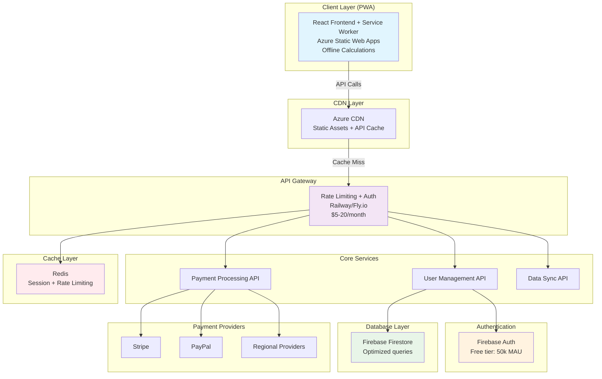

# Architecture Review & Improvements
## Critical Analysis of Full-Stack Transformation Plan

### 🚨 Critical Issues Identified

#### 1. **Calculation Logic Placement - MAJOR ISSUE**
**Problem**: The original plan suggests moving calculation logic to the backend, creating unnecessary complexity.

**Issues:**
- Increased API calls for every calculation (poor UX)
- Higher server costs and latency
- Unnecessary token consumption for basic calculations
- Slower user experience

**Recommended Fix:**
```typescript
// Keep client-side for basic calculations
const basicCalculation = calculateMortgage(params); // Free, instant

// Server-side only for premium features
const advancedScenario = await api.post('/calculations/advanced', params);
const pdfExport = await api.post('/exports/pdf', calculationId);
```

#### 2. **Token System Design Flaw**
**Problem**: Original plan consumes tokens for basic calculations.

**Issues:**
- Users will hit limits quickly
- Reduces engagement and conversion
- Creates friction for core functionality

**Improved Token Strategy:**
```typescript
interface UserLimits {
  // Free Tier - Unlimited basic calculations
  savedCalculations: 5;
  exportsPDF: 0;
  advancedScenarios: 0;
  shareableLinks: 1;
  
  // Premium Tier
  savedCalculations: 'unlimited';
  exportsPDF: 'unlimited';
  advancedScenarios: 'unlimited';
  shareableLinks: 'unlimited';
  prioritySupport: true;
}
```

#### 3. **Database Over-Engineering**
**Problem**: Storing full calculation results wastes storage and creates redundancy.

**Issues:**
- Increased storage costs
- Slower queries
- Data synchronization problems
- Unnecessary complexity

**Improved Data Model:**
```typescript
interface SavedCalculation {
  id: string;
  userId: string;
  name: string;
  inputParams: LoanInputParams;  // Store inputs only
  tags: string[];
  isPublic: boolean;
  shareToken?: string;
  createdAt: Timestamp;
  updatedAt: Timestamp;
  // Remove: results (calculate on demand - calculations are fast)
}
```

#### 4. **Missing Offline Capability**
**Problem**: No offline functionality planned.

**Impact:** Poor UX when internet is unstable

**Solution:** Implement Progressive Web App (PWA) features:
```typescript
// Service Worker for offline calculations
self.addEventListener('fetch', (event) => {
  if (event.request.url.includes('/calculate')) {
    // Handle offline calculation
    event.respondWith(handleOfflineCalculation(event.request));
  }
});
```

#### 5. **Security & IP Protection Concerns**
**Problem:** Exposing calculation algorithms via API endpoints.

**Risk:** Competitors could reverse-engineer proprietary algorithms

**Solution:** Keep sensitive calculations client-side, only expose data operations

### 🔧 Technical Improvements

#### 6. **Caching Strategy Missing**
**Current:** No caching layer planned
**Improvement:** Add Redis for:
- User session data
- Rate limiting counters  
- Frequently accessed user preferences
- Feature flag cache

#### 7. **Error Handling & Resilience**
**Missing:** Comprehensive error handling strategy
**Add:**
```typescript
// Circuit breaker pattern
const circuitBreaker = new CircuitBreaker(externalService, {
  timeout: 3000,
  errorThresholdPercentage: 50,
  resetTimeout: 30000
});

// Retry logic with exponential backoff
const retryConfig = {
  retries: 3,
  retryDelay: (retryCount) => Math.pow(2, retryCount) * 1000
};
```

#### 8. **Monitoring & Observability Gaps**
**Current:** Limited monitoring strategy
**Improvements:**
- Application Performance Monitoring (Sentry/DataDog)
- Real User Monitoring for frontend performance
- Business metrics dashboard
- Alert system for critical issues
- Custom metrics for conversion funnel

### 💰 Cost Optimization Issues

#### 9. **Firebase Costs Underestimated**
**Problem:** Firestore costs can escalate with document reads

**Mitigation Strategies:**
```typescript
// Implement pagination to reduce reads
const getCalculations = async (userId: string, limit = 10, startAfter?: string) => {
  let query = db.collection('calculations')
    .where('userId', '==', userId)
    .orderBy('createdAt', 'desc')
    .limit(limit);
    
  if (startAfter) {
    query = query.startAfter(startAfter);
  }
  
  return query.get();
};

// Cache frequently accessed data
const userCache = new Map();
```

#### 10. **Hosting Platform Limitations**
**Render Issues:**
- Cold start problems (can take 30+ seconds)
- Limited regions (mainly US)
- No edge computing

**Alternative Recommendations:**
1. **Railway** - Better cold start, EU regions, $5/month
2. **Fly.io** - Edge computing, global regions, $1.94/month base
3. **Azure Container Apps** - Stay in Azure ecosystem, consumption-based pricing

## Payment Provider Analysis

### Comprehensive Comparison

| Provider | Fees | Pros | Cons | Best For |
|----------|------|------|------|----------|
| **Stripe** | 2.9% + 30¢ | Industry standard, excellent docs | Higher fees, US-focused | Global reach, comprehensive features |
| **PayPal** | 2.9% + fixed | Widely trusted, international | Complex integration | User trust, international |
| **Paddle** | 5% + processing | Handles VAT/taxes, EU-friendly | Higher fees, less flexible | SaaS, EU compliance |
| **LemonSqueezy** | 3.5% + processing | Developer-friendly, handles taxes | Newer platform | Indie developers |
| **Razorpay** | 2% domestic, 3% intl | Low fees, India-focused | Limited international | Indian market |
| **Square** | 2.9% + 30¢ | Small business friendly | Limited international | US small businesses |
| **Adyen** | Negotiable | Enterprise-grade, global | Complex setup, minimums | High-volume businesses |

### Recommended Multi-Provider Strategy

```typescript
interface PaymentConfig {
  primary: 'stripe';      // Default for most users
  fallback: 'paypal';     // If Stripe fails or user prefers
  regional: {
    EU: 'paddle';         // Automatic VAT handling
    IN: 'razorpay';       // Lower fees for Indian users
  };
}

// Implementation
const getPaymentProvider = (userLocation: string, userPreference?: string) => {
  if (userPreference === 'paypal') return 'paypal';
  if (userLocation === 'IN') return 'razorpay';
  if (isEUCountry(userLocation)) return 'paddle';
  return 'stripe'; // Default
};
```

### Implementation Priority
1. **Phase 1:** Stripe (most comprehensive)
2. **Phase 2:** PayPal (increases conversion ~15-20%)
3. **Phase 3:** Regional providers based on user analytics

## Revised Architecture Recommendations

### Updated System Architecture



### Improved Feature Gating Strategy

```typescript
interface FeatureTiers {
  FREE: {
    calculations: 'unlimited';           // Core value proposition
    savedCalculations: 5;
    exportFormats: ['CSV'];
    advancedScenarios: 0;
    shareableLinks: 1;
    support: 'community';
  };
  
  PREMIUM: {
    calculations: 'unlimited';
    savedCalculations: 'unlimited';
    exportFormats: ['CSV', 'PDF', 'Excel'];
    advancedScenarios: 'unlimited';
    shareableLinks: 'unlimited';
    support: 'priority';
    features: [
      'comparison-tool',
      'historical-analysis',
      'custom-branding',
      'api-access'
    ];
  };
}
```

### Security Enhancements

```typescript
// Enhanced API security
app.use(helmet({
  contentSecurityPolicy: {
    directives: {
      defaultSrc: ["'self'"],
      scriptSrc: ["'self'", "'unsafe-inline'", "https://js.stripe.com"],
      styleSrc: ["'self'", "'unsafe-inline'", "https://fonts.googleapis.com"],
      imgSrc: ["'self'", "data:", "https:"],
      connectSrc: ["'self'", "https://api.stripe.com"],
    },
  },
}));

// Rate limiting by user tier
const rateLimitConfig = {
  free: { windowMs: 15 * 60 * 1000, max: 100 },      // 100 requests per 15 minutes
  premium: { windowMs: 15 * 60 * 1000, max: 1000 },  // 1000 requests per 15 minutes
};
```

## Updated Cost Analysis

### Revised Monthly Operating Costs

| Service | Free Tier | Optimized Paid | Notes |
|---------|-----------|----------------|-------|
| **Frontend (Azure Static Web Apps)** | $0 | $0 | Always free |
| **Backend (Railway/Fly.io)** | $0 | $5-20 | Better performance than Render |
| **CDN (Azure CDN)** | $0 | $5-15 | Improves global performance |
| **Firebase Auth** | 50k MAU free | $0.0055/MAU | Very generous free tier |
| **Firestore (optimized)** | 50k reads/day | $0.06/100k reads | With proper pagination |
| **Redis Cache** | $0 | $5-15 | Reduces database calls |
| **Monitoring (Sentry)** | 5k errors/month | $26/month | Essential for production |

### Projected Costs by Scale

| Users | Infrastructure | Monitoring | Payment Processing | Total Monthly |
|-------|---------------|------------|-------------------|---------------|
| 0-1k | $5 | $0 | $20 | $25 |
| 1k-5k | $20 | $26 | $100 | $146 |
| 5k-10k | $35 | $26 | $200 | $261 |
| 10k+ | $50+ | $50+ | $400+ | $500+ |

### Break-even Analysis
- Premium subscription: $9.99/month
- Target conversion: 5-10%
- Break-even: ~25-50 premium users
- Profit margin: ~70% after payment processing fees

## Implementation Recommendations

### Phase 1: Foundation (Week 1-2)
- Set up Railway/Fly.io backend
- Implement basic API with proper error handling
- Set up Firebase Auth integration
- Create user management system

### Phase 2: Core Features (Week 2-3)
- Implement calculation saving (inputs only)
- Add basic premium features
- Set up Stripe integration
- Implement feature flags

### Phase 3: Enhancement (Week 3-4)
- Add PayPal as secondary payment option
- Implement PWA features for offline use
- Add monitoring and analytics
- Performance optimization

### Phase 4: Scale Preparation (Week 4-5)
- Add Redis caching layer
- Implement comprehensive monitoring
- Add regional payment providers
- Load testing and optimization

## Conclusion

The revised architecture addresses critical flaws in the original plan:

1. **Better User Experience**: Keeps calculations client-side for instant results
2. **Improved Economics**: More generous free tier increases conversion
3. **Enhanced Security**: Protects IP while maintaining functionality  
4. **Cost Optimization**: More realistic cost projections with better hosting
5. **Scalability**: Proper caching and monitoring for growth

**Key Changes:**
- Hybrid calculation strategy (client + server)
- Improved token system focused on value-add features
- Better hosting platform selection
- Multi-provider payment strategy
- Comprehensive monitoring and error handling

This revised approach provides a more sustainable path to building a successful SaaS mortgage calculator.