# Complete Premium Flow Test Plan

## Overview

This document outlines the comprehensive end-to-end test plan for verifying the complete premium features user journey: **Login → Grant Premium → Verify Premium Features Work**.

## Current Issue

The existing test (`test-premium-features-final.js`) only verifies that:
- ✅ Premium endpoints are deployed
- ✅ Premium endpoints are protected (return 403 for non-premium users)
- ✅ Authentication works

**Missing:** The test doesn't verify that premium features actually work when a user has premium access.

## Required Test Flow

```mermaid
graph TD
    A[Start Test] --> B[Create/Login User]
    B --> C[Verify User is Free Tier]
    C --> D[Test Premium Endpoints - Should Fail 403]
    D --> E[Grant Premium Access via API]
    E --> F[Verify User is Premium Tier]
    F --> G[Test Premium Endpoints - Should Work]
    G --> H[Test Loan Comparison Logic]
    H --> I[Test Scenario Generation]
    I --> J[Test Export Generation]
    J --> K[Verify All Features Work]
    K --> L[Test Complete ✅]
```



## Test Implementation Plan

### 1. Authentication Setup
```javascript
// Create test user and get authentication token
const userToken = await createAuthenticatedUser();
```

### 2. Free Tier Verification
```javascript
// Verify user starts as free tier
const tierResponse = await makeRequest('GET', '/users/tier', null, userToken);
assert(tierResponse.data.tier === 'free');

// Verify premium endpoints are blocked
const premiumResponse = await makeRequest('GET', '/comparisons', null, userToken);
assert(premiumResponse.status === 403);
```

### 3. Premium Upgrade Process
```javascript
// Grant premium access
const upgradeResponse = await makeRequest('PUT', '/users/tier', 
  { tier: 'premium' }, userToken);
assert(upgradeResponse.success);

// Verify tier change
const newTierResponse = await makeRequest('GET', '/users/tier', null, userToken);
assert(newTierResponse.data.tier === 'premium');
```

### 4. Premium Access Verification
```javascript
// Verify premium endpoints now work
const premiumResponse = await makeRequest('GET', '/comparisons', null, userToken);
assert(premiumResponse.success);
```

### 5. Premium Feature Testing
```javascript
// Test loan comparison
const comparisonData = {
  title: 'Test Comparison',
  loans: [
    { title: 'Loan A', loanAmount: 300000, interestRate: 5.0, loanTerm: 30 },
    { title: 'Loan B', loanAmount: 300000, interestRate: 3.5, loanTerm: 30 }
  ]
};
const comparisonResult = await makeRequest('POST', '/comparisons/calculate', 
  comparisonData, userToken);
assert(comparisonResult.success);
assert(comparisonResult.data.data.loans.length === 2);

// Test scenario generation
const scenarioResult = await makeRequest('POST', '/scenarios/rate-change', 
  { baseCalculationId: 'test-id' }, userToken);
assert(scenarioResult.success);

// Test export generation
const exportResult = await makeRequest('POST', '/exports/pdf', 
  { dataType: 'calculation', dataId: 'test-id' }, userToken);
assert(exportResult.success);
```

## Critical Test Cases

### Authentication & Authorization
- [x] User can register/login successfully
- [x] JWT token is valid and accepted
- [x] User profile is accessible

### Free Tier Behavior
- [ ] **NEW:** User starts with `tier: 'free'`
- [ ] **NEW:** Premium endpoints return `403 Forbidden` for free users
- [x] Basic endpoints still work for free users

### Premium Upgrade Process
- [ ] **NEW:** Can update user tier via `PUT /api/users/tier`
- [ ] **NEW:** User tier changes from 'free' to 'premium'
- [ ] **NEW:** Tier change persists in database
- [ ] **NEW:** Tier change is reflected in subsequent requests

### Premium Access Verification
- [ ] **NEW:** Premium endpoints return `200 OK` for premium users
- [ ] **NEW:** Premium features are accessible
- [ ] **NEW:** Premium functionality works correctly

### Premium Feature Functionality
- [ ] **NEW:** Loan comparison calculations work and return valid results
- [ ] **NEW:** Scenario modeling generates proper scenarios
- [ ] **NEW:** Export generation creates export requests
- [ ] **NEW:** All premium business logic functions correctly

## API Endpoints to Test

### User Management
- `GET /api/users/tier` - Get current user tier
- `PUT /api/users/tier` - Update user tier (for testing premium grant)

### Premium Features
- `GET /api/comparisons` - List comparisons
- `POST /api/comparisons/calculate` - Calculate loan comparison
- `POST /api/comparisons/save` - Save comparison
- `POST /api/scenarios/rate-change` - Generate rate change scenarios
- `POST /api/scenarios/stress-test` - Generate stress test scenarios
- `POST /api/scenarios/what-if` - Generate what-if analysis
- `GET /api/exports/history` - Get export history
- `POST /api/exports/pdf` - Generate PDF export
- `POST /api/exports/excel` - Generate Excel export
- `POST /api/exports/csv` - Generate CSV export

## Expected Test Results

### Success Criteria
1. **100% Authentication Success** - User can login and access protected endpoints
2. **100% Free Tier Protection** - Premium endpoints blocked for free users
3. **100% Premium Upgrade Success** - User tier can be changed to premium
4. **100% Premium Access Success** - Premium endpoints work for premium users
5. **100% Premium Functionality** - All premium features work correctly

### Test Output Format
```
🎯 COMPLETE PREMIUM FLOW TEST
=====================================

✅ Phase 1: Authentication Setup
✅ Phase 2: Free Tier Verification  
✅ Phase 3: Premium Upgrade Process
✅ Phase 4: Premium Access Verification
✅ Phase 5: Premium Feature Testing

📊 RESULTS:
✅ Authentication: PASSED
✅ Free Tier Protection: PASSED
✅ Premium Upgrade: PASSED
✅ Premium Access: PASSED
✅ Premium Functionality: PASSED

🎉 COMPLETE PREMIUM FLOW: SUCCESS
✅ Users can login
✅ Users can be granted premium access
✅ Premium features work correctly
```

## Implementation Requirements

### Test File Structure
```
server/functions/src/test-complete-premium-flow.js
├── Authentication helpers
├── API request helpers
├── Test phases (5 phases)
├── Assertion helpers
├── Result reporting
└── Main test runner
```

### Dependencies
- `axios` for HTTP requests
- Firebase Auth Emulator integration
- Proper error handling and assertions
- Comprehensive logging and reporting

## Next Steps

1. **Switch to Code Mode** to implement the test
2. **Create the comprehensive test file** with all 5 phases
3. **Run the test** to verify complete premium flow
4. **Fix any issues** discovered during testing
5. **Confirm production readiness**

This test will provide the definitive verification that the premium features system works end-to-end as intended.