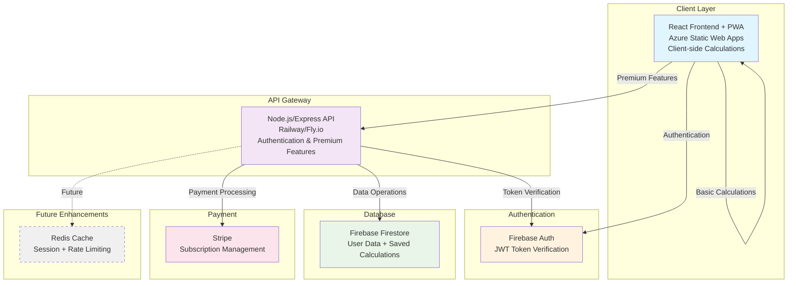

# Final Architecture Decision Document
## Full-Stack Transformation: Mortgage Calculator

### Executive Summary

This document outlines the final architectural decisions for transforming the existing front-end-only mortgage calculator into a scalable, maintainable full-stack application with user authentication, payment processing, and premium features.

### Technology Stack

**Frontend**
- React 18 + TypeScript + Vite (existing)
- Radix UI + Tailwind CSS (existing)
- Progressive Web App (PWA) capabilities

**Backend**
- Node.js + Express + TypeScript
- Railway or Fly.io hosting ($5-20/month)

**Database & Authentication**
- Firebase Firestore + Auth
- Redis (optional future enhancement for caching)

**Payment Processing**
- Stripe (primary provider)

### Core Architecture Principles

#### 1. Hybrid Calculation Strategy

**Client-Side (Free & Fast)**
```typescript
// Basic mortgage calculations - always free and instant
const basicCalculation = calculateMortgage({
  principal: 300000,
  interestRate: 3.5,
  loanTerm: 30
});

// Single loan analysis - client-side
const amortizationSchedule = generateAmortizationSchedule(loanParams);
```

**Server-Side (Premium Features)**
```typescript
// Loan comparison engine - premium feature
const comparison = await api.post('/api/calculations/compare', {
  loans: [loan1, loan2, loan3],
  scenarios: ['standard', 'overpayment', 'rateChange']
});

// Advanced scenario modeling - premium feature
const advancedScenario = await api.post('/api/calculations/advanced', {
  loanParams,
  scenarios: ['marketCrash', 'rateVolatility', 'inflationAdjusted']
});

// Export generation - premium feature
const pdfExport = await api.post('/api/exports/pdf', { calculationId });
```

#### 2. User-Controlled Data Saving

**Default Behavior**: Calculations are temporary and client-side only
**Explicit Saving**: Users must actively choose to save calculations

```typescript
interface SaveCalculationRequest {
  name: string;
  inputParams: LoanInputParams;
  tags?: string[];
  isPublic?: boolean;
}

// User explicitly saves calculation
const saveCalculation = async (params: SaveCalculationRequest) => {
  // Check user's save slots
  const userLimits = await getUserLimits();
  if (userLimits.savedCalculations >= userLimits.maxSaved) {
    throw new Error('Save limit reached. Upgrade to premium for unlimited saves.');
  }
  
  return api.post('/api/calculations/save', params);
};
```

#### 3. Feature Tier Strategy

```typescript
interface FeatureTiers {
  FREE: {
    calculations: 'unlimited';           // Core value - always free
    savedCalculations: 3;                // Limited saves
    loanComparisons: 0;                  // No comparisons
    exportFormats: [];                   // No exports
    advancedScenarios: 0;                // No advanced features
    shareableLinks: 1;                   // One shareable calculation
    support: 'community';
  };
  
  PREMIUM: {
    calculations: 'unlimited';
    savedCalculations: 'unlimited';
    loanComparisons: 'unlimited';        // Multi-loan analysis
    exportFormats: ['PDF', 'Excel', 'CSV'];
    advancedScenarios: 'unlimited';      // Market scenarios, stress testing
    shareableLinks: 'unlimited';
    support: 'priority';
    features: [
      'comparison-dashboard',
      'scenario-modeling',
      'market-analysis',
      'custom-reports',
      'api-access'
    ];
  };
}
```

### System Architecture



### API Design

#### Core Endpoints

**Authentication**
```typescript
POST   /api/auth/verify          // Verify Firebase token
GET    /api/auth/user            // Get current user profile
PUT    /api/auth/user            // Update user profile
```

**Calculation Management**
```typescript
GET    /api/calculations         // List user's saved calculations
POST   /api/calculations/save    // Save calculation (consumes save slot)
GET    /api/calculations/:id     // Get saved calculation
PUT    /api/calculations/:id     // Update saved calculation
DELETE /api/calculations/:id     // Delete saved calculation
GET    /api/calculations/public/:token // Get public shared calculation
```

**Premium Features**
```typescript
POST   /api/calculations/compare      // Compare multiple loans (premium)
POST   /api/calculations/advanced     // Advanced scenario modeling (premium)
POST   /api/exports/pdf              // Generate PDF export (premium)
POST   /api/exports/excel            // Generate Excel export (premium)
```

**Payment & Subscription**
```typescript
POST   /api/payments/create-intent   // Create Stripe payment intent
POST   /api/payments/webhook         // Stripe webhook handler
GET    /api/payments/history         // User's payment history
POST   /api/subscription/cancel      // Cancel subscription
GET    /api/subscription/portal      // Stripe customer portal URL
```

**User Management**
```typescript
GET    /api/users/limits            // Get user's current limits and usage
GET    /api/users/usage             // Get detailed usage statistics
POST   /api/users/upgrade           // Upgrade to premium
```

### Database Schema

#### Users Collection
```typescript
interface User {
  uid: string;                    // Firebase Auth UID
  email: string;
  displayName?: string;
  isPremium: boolean;
  premiumExpiresAt?: Timestamp;
  stripeCustomerId?: string;
  
  // Usage tracking
  savedCalculationsCount: number;
  savedCalculationsLimit: number;
  shareableLinksCount: number;
  shareableLinksLimit: number;
  
  // Preferences
  preferences: {
    currency: 'USD' | 'EUR' | 'GBP' | 'PLN';
    language: 'en' | 'es' | 'pl';
    emailNotifications: boolean;
  };
  
  createdAt: Timestamp;
  updatedAt: Timestamp;
}
```

#### Saved Calculations Collection
```typescript
interface SavedCalculation {
  id: string;
  userId: string;
  name: string;
  
  // Store only input parameters - recalculate results on demand
  inputParams: {
    principal: number;
    interestRatePeriods: Array<{
      startMonth: number;
      interestRate: number;
    }>;
    loanTerm: number;
    overpaymentPlans?: OverpaymentDetails[];
    startDate: Timestamp;
    repaymentModel: 'equalInstallments' | 'decreasingInstallments';
    additionalCosts?: AdditionalCosts;
  };
  
  // Metadata
  tags: string[];
  isPublic: boolean;
  shareToken?: string;              // For public sharing
  
  createdAt: Timestamp;
  updatedAt: Timestamp;
}
```

#### Payments Collection
```typescript
interface Payment {
  id: string;
  userId: string;
  stripePaymentIntentId: string;
  amount: number;                   // Amount in cents
  currency: string;
  status: 'pending' | 'succeeded' | 'failed';
  planType: 'monthly' | 'yearly';
  
  metadata: {
    planName: string;
    features: string[];
  };
  
  createdAt: Timestamp;
  processedAt?: Timestamp;
}
```

### Error Handling & Resilience Strategies

#### 1. API Error Handling
```typescript
// Centralized error handling middleware
app.use((error: Error, req: Request, res: Response, next: NextFunction) => {
  // Log error with context
  logger.error('API Error', {
    error: error.message,
    stack: error.stack,
    url: req.url,
    method: req.method,
    userId: req.user?.uid,
    timestamp: new Date().toISOString()
  });
  
  // Return appropriate error response
  if (error instanceof ValidationError) {
    return res.status(400).json({
      error: 'Validation Error',
      message: error.message,
      details: error.details
    });
  }
  
  if (error instanceof AuthenticationError) {
    return res.status(401).json({
      error: 'Authentication Required',
      message: 'Please log in to access this feature'
    });
  }
  
  if (error instanceof PaymentError) {
    return res.status(402).json({
      error: 'Payment Required',
      message: 'This feature requires a premium subscription'
    });
  }
  
  // Generic server error
  res.status(500).json({
    error: 'Internal Server Error',
    message: 'Something went wrong. Please try again later.'
  });
});
```

#### 2. Retry Logic with Exponential Backoff
```typescript
class ApiClient {
  async request<T>(
    endpoint: string, 
    options: RequestInit,
    retryConfig = { maxRetries: 3, baseDelay: 1000 }
  ): Promise<T> {
    let lastError: Error;
    
    for (let attempt = 0; attempt <= retryConfig.maxRetries; attempt++) {
      try {
        const response = await fetch(endpoint, options);
        
        if (!response.ok) {
          throw new Error(`HTTP ${response.status}: ${response.statusText}`);
        }
        
        return await response.json();
      } catch (error) {
        lastError = error as Error;
        
        // Don't retry on client errors (4xx)
        if (error instanceof Error && error.message.includes('HTTP 4')) {
          throw error;
        }
        
        // Don't retry on last attempt
        if (attempt === retryConfig.maxRetries) {
          break;
        }
        
        // Exponential backoff with jitter
        const delay = retryConfig.baseDelay * Math.pow(2, attempt);
        const jitter = Math.random() * 0.1 * delay;
        await new Promise(resolve => setTimeout(resolve, delay + jitter));
      }
    }
    
    throw lastError;
  }
}
```

#### 3. Circuit Breaker Pattern
```typescript
class CircuitBreaker {
  private failures = 0;
  private lastFailureTime = 0;
  private state: 'CLOSED' | 'OPEN' | 'HALF_OPEN' = 'CLOSED';
  
  constructor(
    private threshold = 5,
    private timeout = 60000,
    private monitoringPeriod = 10000
  ) {}
  
  async execute<T>(operation: () => Promise<T>): Promise<T> {
    if (this.state === 'OPEN') {
      if (Date.now() - this.lastFailureTime > this.timeout) {
        this.state = 'HALF_OPEN';
      } else {
        throw new Error('Circuit breaker is OPEN');
      }
    }
    
    try {
      const result = await operation();
      this.onSuccess();
      return result;
    } catch (error) {
      this.onFailure();
      throw error;
    }
  }
  
  private onSuccess() {
    this.failures = 0;
    this.state = 'CLOSED';
  }
  
  private onFailure() {
    this.failures++;
    this.lastFailureTime = Date.now();
    
    if (this.failures >= this.threshold) {
      this.state = 'OPEN';
    }
  }
}
```

#### 4. Graceful Degradation
```typescript
// Frontend graceful degradation
const useCalculationService = () => {
  const [isOnline, setIsOnline] = useState(navigator.onLine);
  
  useEffect(() => {
    const handleOnline = () => setIsOnline(true);
    const handleOffline = () => setIsOnline(false);
    
    window.addEventListener('online', handleOnline);
    window.addEventListener('offline', handleOffline);
    
    return () => {
      window.removeEventListener('online', handleOnline);
      window.removeEventListener('offline', handleOffline);
    };
  }, []);
  
  const saveCalculation = async (params: SaveCalculationRequest) => {
    if (!isOnline) {
      // Store locally and sync when online
      localStorage.setItem('pendingSave', JSON.stringify(params));
      throw new Error('Offline: Calculation will be saved when connection is restored');
    }
    
    try {
      return await api.post('/api/calculations/save', params);
    } catch (error) {
      // Fallback to local storage
      localStorage.setItem('pendingSave', JSON.stringify(params));
      throw new Error('Unable to save to cloud. Saved locally instead.');
    }
  };
  
  return { saveCalculation, isOnline };
};
```

### Monitoring & Observability Recommendations

#### 1. Application Performance Monitoring (APM)
**Recommended: Sentry**
- Error tracking and performance monitoring
- Real-time alerts for critical issues
- User session replay for debugging
- Cost: $26/month for 5k errors + performance monitoring

```typescript
import * as Sentry from '@sentry/node';

Sentry.init({
  dsn: process.env.SENTRY_DSN,
  environment: process.env.NODE_ENV,
  tracesSampleRate: 0.1, // 10% of transactions
  
  beforeSend(event) {
    // Filter out sensitive data
    if (event.user) {
      delete event.user.email;
    }
    return event;
  }
});
```

#### 2. Business Metrics Dashboard
**Custom Analytics Implementation**
```typescript
interface BusinessMetrics {
  // User metrics
  dailyActiveUsers: number;
  weeklyActiveUsers: number;
  monthlyActiveUsers: number;
  
  // Conversion metrics
  signupRate: number;
  premiumConversionRate: number;
  churnRate: number;
  
  // Usage metrics
  calculationsPerUser: number;
  savedCalculationsPerUser: number;
  featureUsage: Record<string, number>;
  
  // Revenue metrics
  monthlyRecurringRevenue: number;
  averageRevenuePerUser: number;
  lifetimeValue: number;
}

// Track key events
const trackEvent = async (userId: string, event: string, properties?: Record<string, any>) => {
  await db.collection('analytics').add({
    userId,
    event,
    properties,
    timestamp: new Date(),
    userAgent: req.headers['user-agent'],
    ip: req.ip
  });
};
```

#### 3. Real User Monitoring (RUM)
**Frontend Performance Tracking**
```typescript
// Web Vitals tracking
import { getCLS, getFID, getFCP, getLCP, getTTFB } from 'web-vitals';

const sendToAnalytics = (metric: any) => {
  // Send to your analytics service
  fetch('/api/analytics/vitals', {
    method: 'POST',
    body: JSON.stringify(metric)
  });
};

getCLS(sendToAnalytics);
getFID(sendToAnalytics);
getFCP(sendToAnalytics);
getLCP(sendToAnalytics);
getTTFB(sendToAnalytics);
```

#### 4. Alert System
**Critical Alerts Configuration**
```typescript
const alertConfig = {
  errorRate: {
    threshold: 5, // 5% error rate
    window: '5m',
    action: 'email + slack'
  },
  responseTime: {
    threshold: 2000, // 2 seconds
    percentile: 95,
    window: '10m',
    action: 'slack'
  },
  paymentFailures: {
    threshold: 3, // 3 failed payments
    window: '1h',
    action: 'email + sms'
  },
  userSignups: {
    threshold: 0, // No signups
    window: '1h',
    action: 'slack'
  }
};
```

### Cost Analysis

#### Monthly Operating Costs
| Service | Cost | Notes |
|---------|------|-------|
| **Frontend (Azure Static Web Apps)** | $0 | Free tier |
| **Backend (Railway/Fly.io)** | $5-20 | Scales with usage |
| **Firebase Auth + Firestore** | $0-25 | Generous free tier |
| **Stripe** | 2.9% + 30¢ | Per transaction |
| **Monitoring (Sentry)** | $26 | 5k errors + performance |
| **Email (SendGrid)** | $0-20 | 100 emails/day free |
| **Total Base Cost** | $31-91 | Before transaction fees |

#### Revenue Projections
- **Premium Plan**: $9.99/month
- **Target Conversion**: 5-10%
- **Break-even**: 32 premium users ($320/month)
- **Profit Margin**: ~70% after all costs

### Implementation Timeline

#### Phase 1: Foundation (Week 1-2)
- [ ] Set up Railway/Fly.io backend
- [ ] Implement Firebase Auth integration
- [ ] Create basic API structure with error handling
- [ ] Set up Stripe integration
- [ ] Implement user management

#### Phase 2: Core Features (Week 2-3)
- [ ] Implement calculation saving system
- [ ] Add premium feature gating
- [ ] Create loan comparison engine (server-side)
- [ ] Set up monitoring and logging
- [ ] Add basic export functionality

#### Phase 3: Polish & Launch (Week 3-4)
- [ ] Comprehensive testing
- [ ] Performance optimization
- [ ] Security audit
- [ ] Documentation
- [ ] Deployment and monitoring setup

#### Phase 4: Future Enhancements (Month 2+)
- [ ] Redis caching layer
- [ ] Advanced scenario modeling
- [ ] API access for premium users
- [ ] Mobile app considerations
- [ ] International expansion

### Success Metrics

#### Technical KPIs
- API response time: <200ms (95th percentile)
- Uptime: >99.9%
- Error rate: <1%
- Page load time: <2 seconds

#### Business KPIs
- User registration rate: Track weekly
- Premium conversion rate: Target 5-10%
- Monthly churn rate: <5%
- Customer satisfaction: NPS >50

This architecture provides a solid foundation for building a successful SaaS mortgage calculator with clear separation of free and premium features, robust error handling, and comprehensive monitoring.