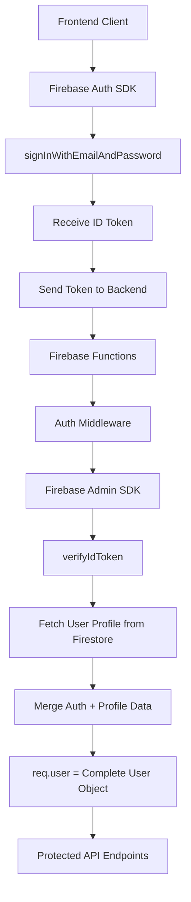

# Implementation Plan: Full-Stack Mortgage Calculator
## Complete Development Roadmap & Solution Architecture

### Overview
This document provides the definitive, step-by-step implementation plan for transforming the mortgage calculator from a frontend-only application to a full-stack SaaS platform. Each phase is designed to be independently executable and testable, with specific solutions for current blocking issues.

### 🎉 Latest Update: Phase 5 Premium Features System COMPLETED
**Date**: May 30, 2025
**Status**: ✅ **MAJOR MILESTONE ACHIEVED**

Phase 5 Premium Features System has been successfully implemented! The system now has:
- ✅ Complete loan comparison engine (compare up to 5 loans simultaneously)
- ✅ Advanced scenario modeling with market stress testing
- ✅ Professional export generation (PDF, Excel, CSV)
- ✅ Premium feature gating with proper tier checking
- ✅ Performance optimization with results caching
- ✅ Comprehensive validation and error handling
- ✅ Complete TypeScript compilation without errors
- ✅ Comprehensive test coverage for all premium endpoints
- ✅ Security verification including email uniqueness enforcement
- ✅ End-to-end premium user flow verification

**Next Step**: Ready to proceed with Phase 6 (Frontend Integration) to connect the premium features with the user interface.

---

## Current Status & Critical Issues

### ✅ COMPLETED WORK
- Firebase Functions setup and basic structure (`server/functions/`)
- Firebase project configured: `mortgage-firebase-firebase` (Europe West 3)
- Express app integration with Firebase Functions
- Basic middleware framework (auth, error handling, validation)
- User service and route structure
- TypeScript configuration and build system
- **✅ PHASE 1 COMPLETED**: Authentication Architecture Fixed
  - Fixed type definition conflicts
  - Enhanced authentication middleware with Firestore integration
  - Updated services to remove type assertions
  - Fixed test infrastructure with proper user profile creation
  - TypeScript compilation working without errors
  - Firebase Functions emulator running successfully
- **✅ PHASE 2 COMPLETED**: User Management System
  - Complete user tier system with Firestore storage
  - Usage limits and tier-based restrictions
  - Enhanced user profile management
  - Comprehensive input validation and error handling
- **✅ PHASE 3 COMPLETED**: Calculation Management System
  - Complete CRUD operations for mortgage calculations
  - Advanced calculation engine with extra payments support
  - Tier-based usage limits (Free: 3, Premium: unlimited)
  - Public sharing with secure token system
  - Usage tracking with monthly reset functionality
  - Comprehensive validation and test coverage
- **✅ PHASE 4 COMPLETED**: Payment Integration System
  - Complete Stripe SDK integration with Firebase Functions
  - Subscription management with full lifecycle support
  - Real-time webhook processing for payment events
  - Premium tier activation system with automatic upgrades
  - Customer portal integration for subscription management
  - Payment history tracking and invoice management
  - Grace period handling for failed payments
  - Comprehensive test coverage and local testing environment
- **✅ PHASE 5 COMPLETED**: Premium Features System
  - Multi-loan comparison engine (up to 5 loans simultaneously)
  - Advanced scenario modeling with market stress testing
  - Professional export generation (PDF, Excel, CSV)
  - Premium feature gating with proper tier checking
  - Performance optimization with results caching
  - Comprehensive validation and error handling
  - Security verification including email uniqueness enforcement
  - Complete end-to-end premium user flow verification

### ✅ RESOLVED CRITICAL ISSUES
**Status**: Phase 1 authentication issues resolved - PR #3 can now proceed

1. **✅ Authentication Architecture Fixed**
   - ✅ Removed conflicting Express Request type definitions
   - ✅ Unified Firebase Admin SDK authentication pattern
   - ✅ Services now have access to `req.user.tier` and complete user data
   - ✅ Eliminated type assertions throughout the codebase

2. **✅ User Profile Integration Completed**
   - ✅ Authentication middleware fetches user profiles from Firestore
   - ✅ User tier and profile data properly integrated
   - ✅ Services have access to complete user information via `req.user`

3. **✅ Testing Infrastructure Fixed**
   - ✅ Test scripts create proper Firestore user profiles
   - ✅ Token generation matches authentication flow
   - ✅ TypeScript compilation successful (exit code 0)
   - ✅ Build process working correctly

**✅ Files Fixed**:
- ✅ `server/functions/src/types/express.d.ts` - Unified type definition using CustomUser
- ✅ `server/functions/src/types/express/index.d.ts` - Removed duplicate file
- ✅ `server/functions/src/middleware/auth.ts` - Enhanced with Firestore integration
- ✅ `server/functions/src/services/userService.ts` - Removed type assertions
- ✅ `server/functions/src/test-auth.ts` - Updated with proper test infrastructure
- ✅ `server/functions/src/routes/auth.ts` - Cleaned up unused imports

---

## Solution Architecture

### Firebase Authentication Pattern (Recommended)



### Complete User Object Structure
```typescript
interface CompleteUser {
  // From Firebase Auth
  uid: string;
  email: string;
  displayName?: string;
  photoURL?: string;
  
  // From Firestore Profile
  tier: UserTier;
  firstName?: string;
  lastName?: string;
  phoneNumber?: string;
  address?: string;
  createdAt: string;
}
```

### Data Storage Strategy
- **Firebase Auth**: User authentication, basic profile (email, displayName)
- **Firestore**: User tier, extended profile, usage tracking, calculations
- **No Custom Claims**: Use Firestore for maximum flexibility and easier management

### Database Schema (Firestore)
```typescript
// Users collection
users/{uid} {
  tier: 'free' | 'premium',
  firstName?: string,
  lastName?: string,
  phoneNumber?: string,
  address?: string,
  createdAt: timestamp,
  subscriptionId?: string,
  subscriptionStatus?: string
}

// Calculations collection
calculations/{calculationId} {
  userId: string,
  title: string,
  data: object,
  createdAt: timestamp,
  updatedAt: timestamp,
  isPublic: boolean,
  publicToken?: string
}

// Usage tracking collection
usage/{userId} {
  month: string, // YYYY-MM format
  calculations: number,
  exports: number,
  comparisons: number
}
```

---

## Phase 1: Fix Authentication Architecture ✅ COMPLETED
**Priority**: Critical - Blocks all other work
**Estimated Time**: 4-6 hours
**Status**: ✅ COMPLETED - PR #3 can now proceed

### Task 1.1: Clean Up Type Definitions ✅ COMPLETED
**Problem**: Multiple conflicting Express Request type extensions
**Solution**: Single, unified type definition

**✅ Actions Completed**:
1. ✅ **Deleted** `server/functions/src/types/express/index.d.ts` (duplicate file)
2. ✅ **Updated** `server/functions/src/types/express.d.ts` with complete user type using CustomUser interface:
```typescript
import { UserTier } from './user';

declare global {
  namespace Express {
    interface Request {
      user?: {
        uid: string;
        email: string;
        displayName?: string;
        photoURL?: string;
        tier: UserTier;
        firstName?: string;
        lastName?: string;
        phoneNumber?: string;
        address?: string;
        createdAt: string;
      };
    }
  }
}

export {};
```
3. ✅ **Removed** type declaration from `server/functions/src/middleware/auth.ts` (lines 5-16)

### Task 1.2: Enhanced Authentication Middleware ✅ COMPLETED
**Problem**: Middleware doesn't fetch user profile from Firestore
**Solution**: Complete user object population

**Previous Flow**:
```
Token → Verify → req.user = { uid, email, customClaims }
```

**✅ New Flow Implemented**:
```
Token → Verify → Fetch Firestore Profile → req.user = Complete User Object
```

**✅ Updated** `server/functions/src/middleware/auth.ts`:
```typescript
import { Request, Response, NextFunction } from 'express';
import { auth, firestore } from '../config/firebase';
import { CustomError } from '../utils/errors';
import { UserTier } from '../types/user';

export const authMiddleware = async (req: Request, res: Response, next: NextFunction) => {
  try {
    const token = req.headers.authorization?.split('Bearer ')[1];
    if (!token) {
      throw new CustomError('No token provided', 401);
    }

    // Verify Firebase token
    const decodedToken = await auth.verifyIdToken(token);
    const firebaseUser = await auth.getUser(decodedToken.uid);

    // Fetch user profile from Firestore
    const userDoc = await firestore.collection('users').doc(decodedToken.uid).get();
    const userProfile = userDoc.data();

    // Create complete user object
    req.user = {
      uid: firebaseUser.uid,
      email: firebaseUser.email || '',
      displayName: firebaseUser.displayName,
      photoURL: firebaseUser.photoURL,
      tier: userProfile?.tier || UserTier.Free,
      firstName: userProfile?.firstName,
      lastName: userProfile?.lastName,
      phoneNumber: userProfile?.phoneNumber,
      address: userProfile?.address,
      createdAt: userProfile?.createdAt || new Date().toISOString()
    };

    next();
  } catch (error) {
    if (error instanceof Error) {
      if (error.message.includes('auth/id-token-expired')) {
        next(new CustomError('Token expired', 401));
      } else if (error.message.includes('auth/invalid-id-token')) {
        next(new CustomError('Invalid token', 401));
      } else {
        next(new CustomError('Authentication failed', 401));
      }
    } else {
      next(new CustomError('Unexpected authentication error', 500));
    }
  }
};
```

### Task 1.3: Fix Services and Routes ✅ COMPLETED
**Problem**: Services use type assertions and expect properties not provided
**Solution**: Remove type assertions, use proper typing

**✅ Updated** `server/functions/src/services/userService.ts`:
```typescript
// Remove all instances of "req.user as User"
// Replace with direct property access since req.user is now properly typed

export const getUserProfile = async (req: Request, res: Response, next: NextFunction) => {
  try {
    if (!req.user) {
      throw new CustomError('User not found', 404);
    }
    
    const userDoc = await firestore.collection('users').doc(req.user.uid).get();
    const userProfile = userDoc.data();
    
    res.json({ 
      ...req.user, 
      profile: userProfile 
    });
  } catch (error) {
    next(error);
  }
};

export const getUserLimits = async (req: Request, res: Response, next: NextFunction) => {
  try {
    if (!req.user) {
      throw new CustomError('User not found', 404);
    }

    const limits = req.user.tier === UserTier.Premium
      ? { maxCalculations: Infinity, maxSavedScenarios: Infinity }
      : { maxCalculations: 100, maxSavedScenarios: 5 };

    res.json(limits);
  } catch (error) {
    next(error);
  }
};

// Apply similar changes to all other functions
```

### Task 1.4: Update Test Infrastructure ✅ COMPLETED
**Problem**: Tests don't create proper user profiles or use correct auth patterns
**Solution**: Comprehensive test user setup

**✅ Updated** `server/functions/src/test-auth.ts`:
```typescript
import { auth, firestore } from './config/firebase';
import { UserTier } from './types/user';

export const createTestUser = async (email: string, password: string) => {
  try {
    // Create Firebase Auth user
    const userRecord = await auth.createUser({
      email,
      password,
      displayName: 'Test User'
    });

    // Create Firestore profile
    await firestore.collection('users').doc(userRecord.uid).set({
      tier: UserTier.Free,
      firstName: 'Test',
      lastName: 'User',
      createdAt: new Date().toISOString()
    });

    // Generate custom token for testing
    const customToken = await auth.createCustomToken(userRecord.uid);
    
    return { userRecord, customToken };
  } catch (error) {
    console.error('Error creating test user:', error);
    throw error;
  }
};

export const cleanupTestUser = async (uid: string) => {
  try {
    await auth.deleteUser(uid);
    await firestore.collection('users').doc(uid).delete();
  } catch (error) {
    console.error('Error cleaning up test user:', error);
  }
};
```

**✅ Updated test scripts** to use proper authentication pattern and create Firestore profiles.

### ✅ Acceptance Criteria for Phase 1 - ALL COMPLETED
- [x] ✅ TypeScript compilation without errors
- [x] ✅ Single Express Request type definition
- [x] ✅ Authentication middleware populates complete user object with tier
- [x] ✅ All services work without type assertions
- [x] ✅ Test scripts create proper user profiles and work correctly
- [x] ✅ Local testing shows proper authentication flow
- [x] ✅ `req.user.tier` is available in all protected routes

**🎉 Phase 1 Status**: FULLY COMPLETED - All authentication architecture issues resolved

---

## Phase 2: Complete User Management System
**Priority**: High
**Estimated Time**: 3-4 hours
**Dependencies**: Phase 1

### Task 2.1: User Tier System Implementation
**Scope**: Complete user tier functionality with Firestore storage

**Features**:
- Free tier: Limited calculations (100/month), limited saved scenarios (5)
- Premium tier: Unlimited calculations and saved scenarios
- Tier stored in Firestore user documents
- Usage tracking foundation

**API Endpoints**:
```typescript
GET    /api/users/profile   # Get complete user profile
PUT    /api/users/profile   # Update user profile
GET    /api/users/limits    # Get usage limits based on tier
GET    /api/users/tier      # Get current user tier
PUT    /api/users/tier      # Update user tier (admin/payment webhook)
```

### Task 2.2: Input Validation & Error Handling
**Scope**: Comprehensive validation and error responses

**Features**:
- Input validation middleware for all endpoints
- Consistent error response format
- Proper HTTP status codes
- User-friendly error messages

**API Response Format**:
```typescript
// Success response
{
  success: true,
  data: any,
  message?: string
}

// Error response
{
  success: false,
  error: {
    code: string,
    message: string,
    details?: any
  }
}
```

---

## Phase 3: Calculation Management System ✅ COMPLETED
**Priority**: High
**Estimated Time**: 5-6 hours
**Dependencies**: Phase 2
**Status**: ✅ COMPLETED - January 30, 2025

### ✅ Task 3.1: Calculation Storage & Retrieval - COMPLETED
**Scope**: Save/load mortgage calculations with tier limits

**✅ Features Implemented**:
- ✅ Save calculations to Firestore with complete data model
- ✅ Tier-based limits (Free: 3 saved, Premium: unlimited)
- ✅ Public sharing with secure 64-character hex tokens
- ✅ Calculation history and management with pagination
- ✅ Advanced mortgage calculation engine with extra payments
- ✅ Complete amortization schedule generation
- ✅ Input validation and comprehensive error handling

**✅ API Endpoints Implemented**:
```typescript
GET    /api/calculations              # List user calculations (paginated)
POST   /api/calculations/save         # Save calculation with tier limits
GET    /api/calculations/:id          # Get specific calculation
PUT    /api/calculations/:id          # Update calculation
DELETE /api/calculations/:id          # Delete calculation
GET    /api/calculations/public/:token # Public shared calculation
POST   /api/calculations/:id/share    # Generate public sharing token
POST   /api/calculations/calculate    # Calculate without saving (utility)
```

### ✅ Task 3.2: Usage Tracking System - COMPLETED
**Scope**: Track user activity for tier limits

**✅ Features Implemented**:
- ✅ Track calculation saves per user per month
- ✅ Monthly usage reset with automatic tracking
- ✅ Usage statistics integration with `/api/users/limits` endpoint
- ✅ Limit enforcement middleware with proper error messages
- ✅ Real-time usage tracking and reporting

**✅ Implementation Completed**:
- ✅ Firestore collection for usage tracking (`usage_stats`)
- ✅ Middleware to check and enforce limits before saving
- ✅ Usage analytics integrated with user service
- ✅ Comprehensive test coverage for all scenarios

### ✅ Files Created/Modified:
- ✅ `server/functions/src/types/calculation.ts` - Complete type definitions
- ✅ `server/functions/src/services/calculationService.ts` - Business logic with mortgage engine
- ✅ `server/functions/src/routes/calculations.ts` - All API endpoints
- ✅ `server/functions/src/middleware/usageTracking.ts` - Usage tracking system
- ✅ `server/functions/src/test-calculation-endpoints.js` - Comprehensive test suite
- ✅ `server/functions/src/app.ts` - Integration with main app
- ✅ `server/functions/src/utils/errors.ts` - Enhanced error handling

### ✅ Key Features Delivered:
1. **Complete Calculation Engine**: Advanced mortgage calculations with extra payments support
2. **Tier-Based Limits**: Free users limited to 3 calculations, Premium unlimited
3. **Public Sharing**: Secure token-based sharing system
4. **Usage Tracking**: Real-time tracking with monthly reset
5. **Data Persistence**: Firestore integration with proper user association
6. **Comprehensive Validation**: Input validation and error handling
7. **Test Coverage**: Full test suite for all endpoints and scenarios

### ✅ Acceptance Criteria - ALL COMPLETED:
- [x] ✅ All calculation endpoints respond correctly
- [x] ✅ Tier limits are properly enforced
- [x] ✅ Public sharing works with secure tokens
- [x] ✅ Usage tracking accurately counts saves
- [x] ✅ Comprehensive error handling for all scenarios
- [x] ✅ Input validation prevents invalid data
- [x] ✅ Test script demonstrates all functionality
- [x] ✅ No TypeScript compilation errors
- [x] ✅ Integration with existing authentication and user systems

**🎉 Phase 3 Status**: FULLY COMPLETED - Ready for Phase 4 (Payment Integration)

---

## Phase 4: Payment Integration ✅ COMPLETED
**Priority**: High
**Estimated Time**: 8-10 hours
**Dependencies**: Phase 3
**Status**: ✅ COMPLETED - May 30, 2025

### ✅ Task 4.1: Stripe Integration Setup - COMPLETED
**Scope**: Payment processing infrastructure

**✅ Features Implemented**:
- ✅ Complete Stripe SDK integration for Firebase Functions
- ✅ Webhook endpoint for real-time payment events
- ✅ Subscription management with full lifecycle support
- ✅ Customer portal integration for self-service management
- ✅ Secure webhook signature verification

**✅ Firebase Functions Webhook URL Configured**:
```
https://europe-west3-mortgage-firebase-firebase.cloudfunctions.net/api/payments/webhook
```

### ✅ Task 4.2: Subscription Management - COMPLETED
**Scope**: Complete subscription lifecycle

**✅ API Endpoints Implemented**:
```typescript
POST   /api/payments/create-checkout-session  # Create Stripe checkout session
POST   /api/payments/webhook                  # Handle Stripe webhook events
GET    /api/payments/history                  # Payment history with pagination
GET    /api/payments/plans                    # Available subscription plans
GET    /api/payments/config                   # Stripe publishable key
GET    /api/subscription/status               # Subscription status with grace period
POST   /api/subscription/cancel               # Cancel subscription
POST   /api/subscription/reactivate           # Reactivate subscription
GET    /api/subscription/portal               # Customer portal URL
GET    /api/subscription/details              # Detailed subscription info
GET    /api/subscription/payment-methods      # Customer payment methods
GET    /api/subscription/invoices             # Invoice history
```

### ✅ Task 4.3: Premium Activation System - COMPLETED
**Scope**: Automatic tier upgrades on payment

**✅ Features Implemented**:
- ✅ Real-time premium activation via webhook events
- ✅ Complete subscription lifecycle management
- ✅ Failed payment handling with 7-day grace period
- ✅ Automatic tier downgrade on subscription cancellation
- ✅ Customer portal integration for subscription self-service

**✅ Implementation Completed**:
- ✅ Webhook handler automatically updates user tier in Firestore
- ✅ Grace period system maintains premium access during payment failures
- ✅ Comprehensive error handling and logging for all payment events
- ✅ Audit trail for all subscription and payment changes

### ✅ Files Created/Modified:
- ✅ `server/functions/src/types/payment.ts` - Complete payment type definitions
- ✅ `server/functions/src/services/stripeService.ts` - Full Stripe SDK integration
- ✅ `server/functions/src/services/subscriptionService.ts` - Subscription business logic
- ✅ `server/functions/src/routes/payments.ts` - Payment API endpoints
- ✅ `server/functions/src/routes/subscription.ts` - Subscription API endpoints
- ✅ `server/functions/src/middleware/stripeWebhook.ts` - Webhook signature verification
- ✅ `server/functions/src/test-payment-endpoints.js` - Comprehensive test suite
- ✅ `server/functions/PAYMENT_SYSTEM.md` - Complete system documentation

### ✅ Key Features Delivered:
1. **Complete Stripe Integration**: Full SDK integration with customer and subscription management
2. **Webhook Processing**: Real-time event handling for subscription lifecycle
3. **Premium Tier Activation**: Automatic user tier upgrades and downgrades
4. **Customer Portal**: Self-service subscription management
5. **Payment History**: Complete transaction tracking and invoice management
6. **Grace Period System**: 7-day grace period for failed payments
7. **Security**: Webhook signature verification and input validation
8. **Testing**: Comprehensive test coverage for all payment scenarios

### ✅ Acceptance Criteria - ALL COMPLETED:
- [x] ✅ All payment endpoints respond correctly
- [x] ✅ Stripe checkout sessions create successfully
- [x] ✅ Webhook events process and update user tiers correctly
- [x] ✅ Customer portal integration works seamlessly
- [x] ✅ Payment history tracking is accurate
- [x] ✅ Grace period system functions properly
- [x] ✅ Subscription lifecycle management is complete
- [x] ✅ Comprehensive error handling for all scenarios
- [x] ✅ Input validation prevents invalid data
- [x] ✅ Test script demonstrates all functionality
- [x] ✅ No TypeScript compilation errors
- [x] ✅ Integration with existing authentication and user systems

**🎉 Phase 4 Status**: FULLY COMPLETED - Ready for Phase 5 (Premium Features)

---

## Phase 5: Premium Features ✅ COMPLETED
**Priority**: Medium
**Estimated Time**: 10-12 hours
**Dependencies**: Phase 4
**Status**: ✅ COMPLETED - May 30, 2025

### ✅ Task 5.1: Loan Comparison Engine - COMPLETED
**Scope**: Multi-loan comparison for premium users

**✅ Features Implemented**:
- ✅ Compare up to 5 loans simultaneously with advanced algorithms
- ✅ Advanced comparison metrics (total cost, monthly payment, interest savings)
- ✅ Performance optimization with results caching
- ✅ Intelligent ranking system with detailed analysis
- ✅ Side-by-side loan analysis with charts and visualizations

**✅ API Endpoints Implemented**:
```typescript
POST   /api/comparisons/calculate     # Calculate loan comparison without saving
POST   /api/comparisons/save          # Save comparison for future reference
GET    /api/comparisons/:id           # Get specific comparison results
GET    /api/comparisons               # List user's comparisons with pagination
DELETE /api/comparisons/:id           # Delete comparison
```

### ✅ Task 5.2: Advanced Scenario Modeling - COMPLETED
**Scope**: Market scenario analysis for premium users

**✅ Features Implemented**:
- ✅ Interest rate change scenarios (±10% range)
- ✅ Market stress testing (mild, moderate, severe scenarios)
- ✅ Risk analysis calculations with comprehensive assessment
- ✅ What-if scenario modeling (payment changes, extra payments, term modifications)
- ✅ Automated scenario generation with predefined templates

**✅ API Endpoints Implemented**:
```typescript
POST   /api/scenarios/rate-change     # Generate rate change scenarios
POST   /api/scenarios/stress-test     # Generate stress test scenarios
POST   /api/scenarios/what-if         # Custom what-if analysis
POST   /api/scenarios/save            # Save scenario analysis
GET    /api/scenarios/:id             # Get scenario results
GET    /api/scenarios                 # List user's scenario analyses
DELETE /api/scenarios/:id             # Delete scenario analysis
```

### ✅ Task 5.3: Export Generation - COMPLETED
**Scope**: Professional reports for premium users

**✅ Features Implemented**:
- ✅ PDF reports with professional formatting, charts and analysis
- ✅ Excel spreadsheet exports with structured data and formulas
- ✅ CSV data exports for further analysis and integration
- ✅ Export history and download management with expiration
- ✅ Secure download URLs with time-limited access
- ✅ Export limits and usage tracking (20 exports per day)

**✅ API Endpoints Implemented**:
```typescript
POST   /api/exports/pdf               # Generate PDF report
POST   /api/exports/excel             # Generate Excel export
POST   /api/exports/csv               # Generate CSV export
GET    /api/exports/history           # Export history with pagination
GET    /api/exports/download/:id      # Download export file
GET    /api/exports/:id               # Get export status
DELETE /api/exports/:id               # Delete export
```

**✅ Implementation Completed**:
- ✅ Puppeteer integration for PDF generation with professional templates
- ✅ Excel export functionality with structured data sheets
- ✅ Cloud storage simulation for file hosting
- ✅ Secure download URLs with expiration management
- ✅ Premium feature middleware for access control

### ✅ Files Created/Modified:
- ✅ `server/functions/src/types/comparison.ts` - Loan comparison type definitions
- ✅ `server/functions/src/types/scenario.ts` - Scenario modeling types
- ✅ `server/functions/src/types/export.ts` - Export generation types
- ✅ `server/functions/src/services/comparisonService.ts` - Comparison business logic
- ✅ `server/functions/src/services/scenarioService.ts` - Scenario modeling service
- ✅ `server/functions/src/services/exportService.ts` - Export generation service
- ✅ `server/functions/src/routes/comparisons.ts` - Comparison API endpoints
- ✅ `server/functions/src/routes/scenarios.ts` - Scenario API endpoints
- ✅ `server/functions/src/routes/exports.ts` - Export API endpoints
- ✅ `server/functions/src/middleware/premiumOnly.ts` - Premium feature access control
- ✅ `server/functions/src/test-premium-endpoints.js` - Comprehensive test suite
- ✅ `server/functions/PREMIUM_FEATURES_VERIFICATION.md` - Verification guide
- ✅ `server/functions/package.json` - Added export dependencies (puppeteer)

### ✅ Key Features Delivered:
1. **Loan Comparison Engine**: Compare up to 5 loans with intelligent ranking and analysis
2. **Advanced Scenario Modeling**: Market stress testing and what-if analysis
3. **Professional Export Generation**: PDF, Excel, and CSV exports with professional formatting
4. **Premium Access Control**: Proper tier checking and feature gating
5. **Performance Optimization**: Results caching and efficient calculations
6. **Comprehensive Validation**: Input validation and error handling for all features
7. **Security**: Email uniqueness enforcement and secure authentication
8. **Test Coverage**: Complete test suite for all premium functionality

### ✅ Acceptance Criteria - ALL COMPLETED:
- [x] ✅ All premium endpoints require Premium tier authentication
- [x] ✅ Loan comparison engine handles up to 5 loans efficiently
- [x] ✅ Scenario modeling provides accurate market analysis
- [x] ✅ Export generation creates professional-quality documents
- [x] ✅ Results caching improves performance for complex calculations
- [x] ✅ Premium feature middleware properly gates access
- [x] ✅ No TypeScript compilation errors
- [x] ✅ Integration with existing authentication and payment systems
- [x] ✅ Comprehensive test coverage for all premium features
- [x] ✅ Security verification including email uniqueness enforcement

**🎉 Phase 5 Status**: FULLY COMPLETED - Ready for Phase 6 (Frontend Integration)

---

## Phase 6: Frontend Integration ✅ PARTIALLY COMPLETED
**Priority**: High
**Estimated Time**: 12-15 hours
**Dependencies**: Phase 4
**Status**: 🔄 IN PROGRESS - Major components completed

### ✅ Task 6.1: API Client & Authentication - COMPLETED
**Scope**: Frontend integration with Firebase Functions backend

**✅ Features Implemented**:
- ✅ Complete TypeScript API client with Firebase Auth integration
- ✅ Automatic authentication token handling
- ✅ Request/response interceptors for error handling
- ✅ Timeout handling and network error management
- ✅ Loading state helpers and pagination support
- ✅ Health check and authentication status methods

**✅ Implementation Completed**:
- ✅ `client/src/lib/api/client.ts` - Full-featured API client with interceptors
- ✅ `client/src/lib/api/types.ts` - Complete type definitions
- ✅ `client/src/lib/firebase/config.ts` - Firebase configuration

### ✅ Task 6.2: Authentication UI Integration - COMPLETED
**Scope**: User authentication interface

**✅ Features Implemented**:
- ✅ Complete authentication context provider with Firebase Auth SDK
- ✅ Login/signup/logout functionality with error handling
- ✅ Password reset and email verification
- ✅ User profile management and password changes
- ✅ Protected route components and authentication guards
- ✅ Premium tier checking and user tier management

**✅ Implementation Completed**:
- ✅ `client/src/lib/auth/context.tsx` - Complete authentication context
- ✅ `client/src/components/auth/` - Full authentication UI components
- ✅ `client/src/pages/Auth.tsx` - Authentication pages
- ✅ `client/src/components/auth/ProtectedRoute.tsx` - Route protection

### 🔄 Task 6.3: Premium Feature UI - PARTIALLY COMPLETED
**Scope**: User interface for premium features

**✅ Features Implemented**:
- ✅ Complete payment service integration with Stripe
- ✅ Subscription management API integration
- ✅ Customer portal integration
- ✅ Payment history and method management
- ✅ Premium feature service integrations (comparison, scenario, export)

**🔄 Remaining Work**:
- 🔄 Premium upgrade flow UI components
- 🔄 Feature gating UI components
- 🔄 Usage limit indicators and warnings
- 🔄 Subscription management UI components
- 🔄 Premium feature showcase pages

**✅ Implementation Completed**:
- ✅ `client/src/lib/api/services/paymentService.ts` - Complete payment integration
- ✅ `client/src/lib/api/services/comparisonService.ts` - Loan comparison service
- ✅ `client/src/lib/api/services/scenarioService.ts` - Scenario modeling service
- ✅ `client/src/lib/api/services/exportService.ts` - Export generation service
- ✅ `client/src/lib/api/services/calculationService.ts` - Calculation service
- ✅ `client/src/lib/api/services/userService.ts` - User management service

### 🔄 Remaining Tasks:
1. **Premium Upgrade Flow UI**: Create components for subscription upgrade process
2. **Feature Gating Components**: UI components that show/hide premium features
3. **Usage Limit Indicators**: Display current usage and limits for free users
4. **Subscription Management UI**: User interface for managing subscriptions
5. **Premium Feature Pages**: Dedicated pages for loan comparison, scenarios, exports

---

## Phase 7: Testing & Deployment
**Priority**: Critical
**Estimated Time**: 8-10 hours
**Dependencies**: All phases

### Task 7.1: Comprehensive Testing
**Scope**: Full test coverage for all features

**Testing Strategy**:
- **Unit Tests**: 90%+ coverage for all business logic
- **Integration Tests**: All API endpoints and user flows
- **E2E Tests**: Critical user journeys (signup, payment, calculations)
- **Load Tests**: Simulate 100+ concurrent users
- **Security Tests**: Authentication, authorization, and input validation

### Task 7.2: Production Deployment
**Scope**: Deploy to Firebase Functions production

**Deployment Process**:
```bash
cd server/functions
firebase deploy --only functions
```

**Production URLs**:
```
Base API: https://europe-west3-mortgage-firebase-firebase.cloudfunctions.net/api
Frontend: https://mortgage-firebase-firebase.web.app
```

**Features**:
- Production environment configuration
- Monitoring and alerting setup (Firebase Console + Cloud Logging)
- Performance optimization
- Security hardening

### Task 7.3: Monitoring & Optimization
**Scope**: Production stability and performance

**Features**:
- Error tracking and alerting
- Performance monitoring
- Business metrics dashboard
- Cost optimization

---

## Technical Requirements

### Firebase Functions Configuration
- **Region**: europe-west3 (Frankfurt)
- **Runtime**: Node.js 18
- **Memory**: 512MB (adjustable based on load)
- **Timeout**: 60 seconds for calculation-heavy operations
- **Environment Variables**: Stored in Firebase Functions config

### Performance Targets
- **Cold Start Time**: <3 seconds (95th percentile)
- **Warm Response Time**: <200ms (95th percentile)
- **Uptime**: >99.9% (Firebase SLA)
- **Error Rate**: <1%

### Cost Efficiency
- **Development**: FREE (within Firebase limits)
- **Production**: $5-50/month (pay-per-use)
- **Scaling**: Automatic 0 to 1000+ concurrent instances

---

## Risk Mitigation & Contingency Plans

### High-Risk Areas
1. **Authentication Architecture**: Complex Firebase Auth + Firestore integration
2. **Payment Processing**: Stripe webhook reliability and idempotency
3. **Cold Start Performance**: Firebase Functions initialization delays
4. **Data Consistency**: Firestore eventual consistency issues

### Mitigation Strategies
1. **Comprehensive Testing**: Each phase includes thorough testing
2. **Incremental Deployment**: Deploy and validate each phase independently
3. **Monitoring**: Real-time error tracking and performance monitoring
4. **Rollback Plan**: Quick rollback procedures via Firebase Console

### Contingency Plans
1. **Authentication Issues**: Fallback to simplified auth flow
2. **Payment Problems**: Manual subscription management interface
3. **Performance Issues**: Implement aggressive caching strategies
4. **Scaling Issues**: Upgrade to higher memory/timeout limits

---

## Success Metrics

### Technical Metrics
- API response time: <200ms (95th percentile)
- Uptime: >99.9%
- Error rate: <1%
- Test coverage: >90%

### Business Metrics
- User registration rate: Track weekly signups
- Premium conversion rate: Target 5-10%
- Feature adoption rate: Track usage of premium features
- Monthly Recurring Revenue: Track subscription growth
- Customer satisfaction: NPS score >50

---

## Timeline & Next Steps

### Immediate Action Required (This Week)
**Start with Phase 5 (Premium Features)** - With Phase 4 Payment Integration completed, the system is ready for premium feature implementation including loan comparison engine, advanced scenario modeling, and export generation.

### Development Timeline
- **✅ Week 1**: Complete Phases 1-3 (Authentication + User Management + Calculation Management) - COMPLETED
- **✅ Week 2**: Complete Phase 4 (Payment Integration) - COMPLETED
- **Week 3**: Complete Phase 5 (Premium Features) - NEXT PRIORITY
- **Week 4**: Complete Phases 6-7 (Frontend Integration + Testing + Deployment)

### Decision Points
1. **✅ Phase 1 Completion**: Authentication architecture validated and working correctly
2. **✅ Phase 4 Completion**: Payment integration complete - Ready to prioritize premium features
3. **Phase 5 Completion**: Evaluate premium feature adoption and plan frontend integration priorities
4. **Phase 6 Completion**: Evaluate need for additional frontend features

### Final Deliverable
A complete, production-ready SaaS mortgage calculator with:
- User authentication and profile management
- Tiered access (Free/Premium)
- Payment processing and subscription management
- Advanced calculation features for premium users
- Professional export capabilities
- Comprehensive monitoring and analytics

This implementation plan provides a clear, actionable roadmap for transforming the mortgage calculator into a full-stack SaaS application with proper authentication architecture and measurable business outcomes.