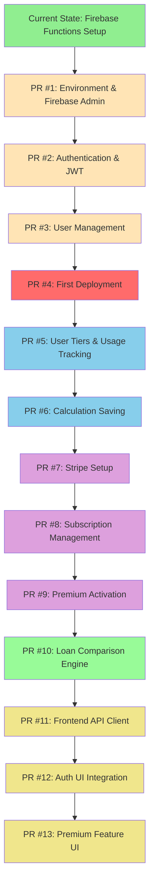
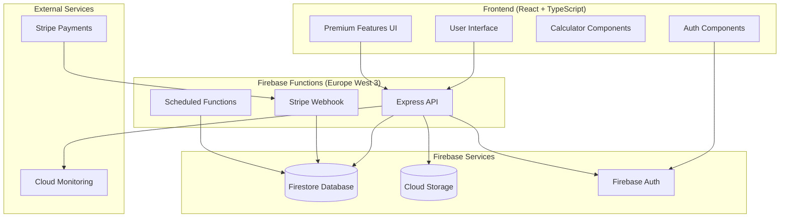
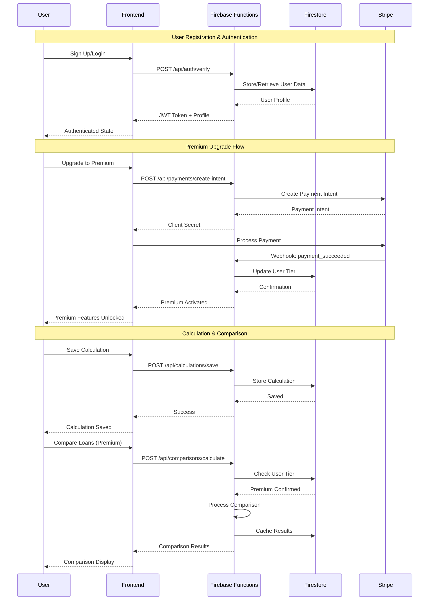
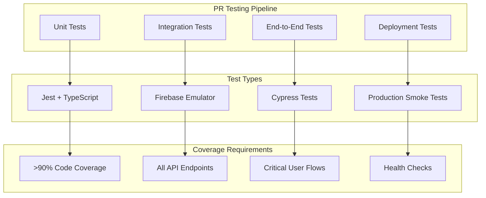
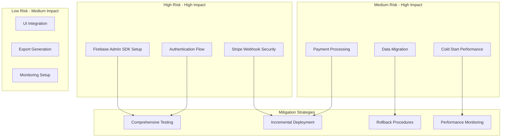
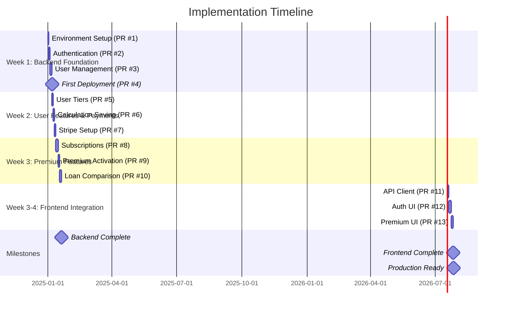
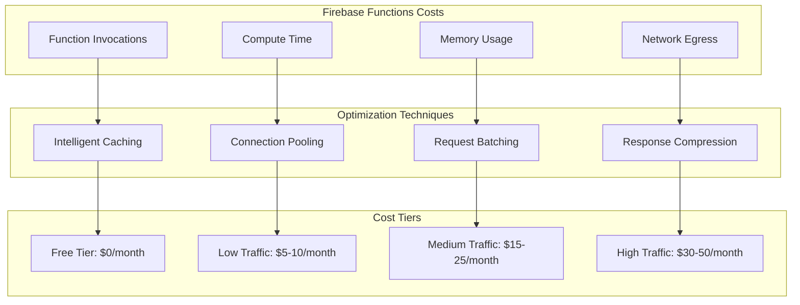
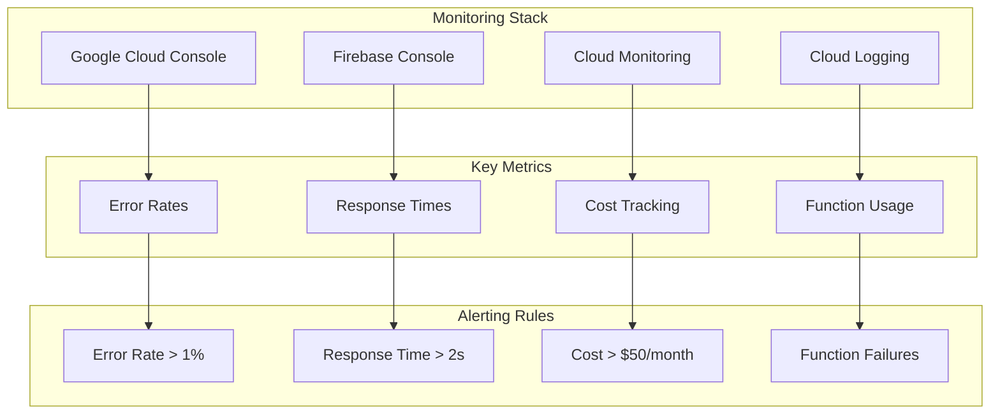
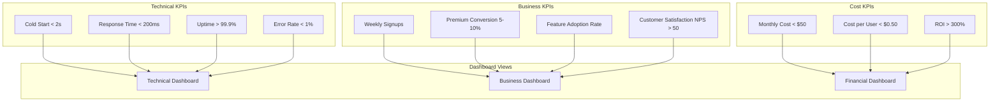

# Implementation Roadmap: Visual Guide
## Full-Stack Mortgage Calculator Development Plan

### Overview
This document provides a visual representation of the implementation roadmap with detailed Mermaid diagrams showing the development flow, dependencies, and architecture.

---

## Development Flow Diagram



**Legend:**
- 🟢 Green: Completed
- 🟡 Orange: Backend Foundation (Week 1)
- 🔴 Red: Critical Deployment Milestone
- 🔵 Blue: User Management (Week 1-2)
- 🟣 Purple: Payment Integration (Week 2-3)
- 🟢 Light Green: Premium Features (Week 3)
- 🟡 Yellow: Frontend Integration (Week 3-4)

---

## Architecture Overview



---

## Pull Request Dependencies

```mermaid
graph LR
    subgraph "Week 1: Backend Foundation"
        PR1[PR #1: Environment Setup]
        PR2[PR #2: Authentication]
        PR3[PR #3: User Management]
        PR4[PR #4: First Deployment]
        
        PR1 --> PR2
        PR2 --> PR3
        PR3 --> PR4
    end
    
    subgraph "Week 2: User Features"
        PR5[PR #5: User Tiers]
        PR6[PR #6: Calculation Saving]
        
        PR4 --> PR5
        PR5 --> PR6
    end
    
    subgraph "Week 2-3: Payments"
        PR7[PR #7: Stripe Setup]
        PR8[PR #8: Subscriptions]
        PR9[PR #9: Premium Activation]
        
        PR6 --> PR7
        PR7 --> PR8
        PR8 --> PR9
    end
    
    subgraph "Week 3: Premium Features"
        PR10[PR #10: Loan Comparison]
        
        PR9 --> PR10
    end
    
    subgraph "Week 3-4: Frontend"
        PR11[PR #11: API Client]
        PR12[PR #12: Auth UI]
        PR13[PR #13: Premium UI]
        
        PR4 --> PR11
        PR11 --> PR12
        PR12 --> PR13
    end
```



---

## Data Flow Architecture



---

## Firebase Functions Structure

```mermaid
graph TD
    subgraph "Firebase Functions Deployment"
        MAIN[Main API Function]
        WEBHOOK[Stripe Webhook Function]
        SCHEDULED[Usage Reset Function]
        CLEANUP[Export Cleanup Function]
    end
    
    subgraph "Express App Structure"
        ROUTES[Route Handlers]
        MIDDLEWARE[Middleware Stack]
        SERVICES[Business Logic Services]
        UTILS[Utility Functions]
    end
    
    subgraph "Route Handlers"
        AUTH_R[/api/auth/*]
        USER_R[/api/users/*]
        CALC_R[/api/calculations/*]
        PAY_R[/api/payments/*]
        COMP_R[/api/comparisons/*]
    end
    
    subgraph "Services Layer"
        AUTH_S[AuthService]
        USER_S[UserService]
        CALC_S[CalculationService]
        STRIPE_S[StripeService]
        COMP_S[ComparisonService]
    end
    
    MAIN --> ROUTES
    ROUTES --> MIDDLEWARE
    MIDDLEWARE --> SERVICES
    SERVICES --> UTILS
    
    ROUTES --> AUTH_R
    ROUTES --> USER_R
    ROUTES --> CALC_R
    ROUTES --> PAY_R
    ROUTES --> COMP_R
    
    AUTH_R --> AUTH_S
    USER_R --> USER_S
    CALC_R --> CALC_S
    PAY_R --> STRIPE_S
    COMP_R --> COMP_S
```

---

## Testing Strategy per PR



---

## Risk Assessment Matrix



---

## Timeline Visualization



---

## Cost Optimization Strategy



---

## Monitoring & Alerting Setup



---

## Success Metrics Dashboard



This visual roadmap provides a comprehensive overview of the implementation plan with clear dependencies, timelines, and success metrics. Each diagram helps visualize different aspects of the development process to ensure we build a robust, scalable, and cost-effective full-stack SaaS platform.