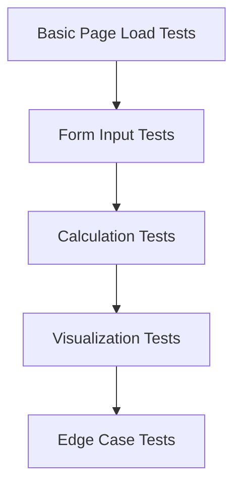

# Mortgage Calculator UI Test Plan

## Test Case Development

This document outlines the test cases for the Mortgage Calculator UI testing using Puppeteer.

### 2.1 Basic Page Load Tests

- **Verify the application loads correctly**
  - Test that the main page loads without errors
  - Check that the page title is correct
  - Verify that the application container is present

- **Check that all main components are visible**
  - Verify LoanInputForm is visible
  - Verify LoanSummary section is present (even if empty initially)
  - Check that the Calculate button is present and enabled

- **Validate initial state**
  - Verify default values in the loan form
  - Check that currency selector shows the default currency
  - Ensure that the form is in a valid initial state

### 2.2 Form Input Tests

- **Test loan amount input**
  - Enter valid loan amounts and verify they are accepted
  - Check that the input properly formats numbers
  - Verify that the currency symbol is displayed correctly

- **Test interest rate inputs**
  - Add single interest rate period
  - Add multiple interest rate periods
  - Verify date ranges for interest periods are calculated correctly

- **Test loan term input**
  - Set different loan terms (1-40 years)
  - Verify that changing loan term updates interest rate periods appropriately
  - Check validation for minimum and maximum values

- **Test repayment model selection**
  - Select each repayment model option
  - Verify the selection is saved correctly
  - Check that appropriate UI elements appear/disappear based on selection

- **Test overpayment plan inputs**
  - Add a single overpayment plan
  - Add multiple overpayment plans
  - Test different frequencies (monthly, quarterly, annual, one-time)
  - Test different effects (reduce term, reduce payment)

- **Test date selection**
  - Set loan start date
  - Set interest rate period dates
  - Set overpayment start and end dates
  - Verify date picker UI works correctly

### 2.3 Calculation Tests

- **Test basic loan calculation**
  - Fill out minimal required fields
  - Click calculate button
  - Verify results appear in the summary section

- **Test with different interest rates**
  - Calculate with low interest rate (e.g., 1%)
  - Calculate with medium interest rate (e.g., 4.5%)
  - Calculate with high interest rate (e.g., 10%)
  - Verify calculations are correct for each scenario

- **Test with overpayments**
  - Calculate with a single monthly overpayment
  - Calculate with multiple overpayment plans
  - Calculate with different overpayment frequencies
  - Verify overpayment impact on total interest and loan term

- **Verify calculation results match expected values**
  - Check monthly payment calculation
  - Verify total interest calculation
  - Confirm total cost calculation
  - Validate actual term calculation with overpayments

### 2.4 Visualization Tests

- **Verify chart rendering**
  - Check that charts appear after calculation
  - Verify chart data matches calculation results
  - Test chart interactions (if any)

- **Check amortization schedule display**
  - Verify yearly data is displayed correctly
  - Check that the table has the correct number of rows
  - Confirm totals in the table match summary values

- **Test savings spotlight calculations**
  - Verify money saved calculation
  - Check time saved calculation
  - Validate percentage saved calculation
  - Ensure currency symbol is displayed correctly

### 2.5 Edge Case Tests

- **Test with minimum/maximum values**
  - Test with minimum loan amount
  - Test with maximum loan amount
  - Test with minimum/maximum loan terms
  - Test with extreme interest rates

- **Test with invalid inputs**
  - Enter negative loan amount
  - Enter invalid interest rates
  - Input invalid dates
  - Verify appropriate validation messages appear

- **Test currency changes**
  - Change currency and verify symbol updates throughout the application
  - Check that changing currency doesn't affect numerical calculations
  - Test with different currencies (USD, EUR, GBP, etc.)

## Implementation Priority

1. Basic Page Load Tests
2. Form Input Tests
3. Calculation Tests
4. Visualization Tests
5. Edge Case Tests

Each test category should be implemented incrementally, starting with the most basic functionality and building up to more complex scenarios.