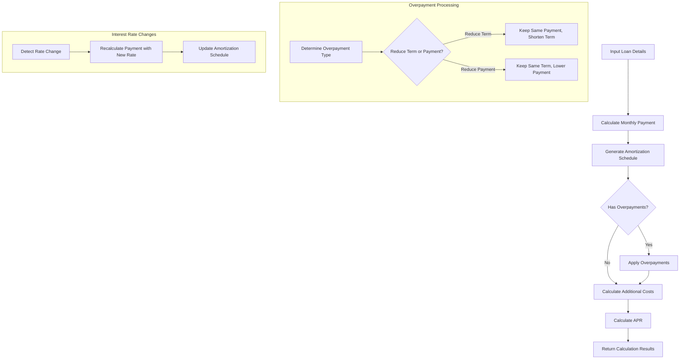

Based on the code I've examined, I now have a good understanding of how the mortgage calculator works. Let me organize what I've learned to create a comprehensive explanation of mortgage calculation algorithms and compare them with the implementation in this app.

Key components I've identified:

1. Core mortgage calculation formula (in utils.ts)
2. Handling of initial costs (one-time fees)
3. Handling of recurring costs
4. Multiple interest rate periods
5. Overpayment strategies (one-time and recurring)
6. Different repayment models (equal installments vs. decreasing installments)
7. APR calculation

I'll structure my response as follows:

1. General mortgage calculation algorithm
2. Handling initial costs
3. Multiple interest rate periods
4. Overpayment strategies
5. Comparison with the app's implementation
6. Strengths and limitations of the app's approach

# Mortgage Calculation Algorithms and Implementation Analysis

Based on my analysis of the codebase, I'll provide a detailed explanation of mortgage calculation algorithms and compare them with the implementation in this application.

## 1. Standard Mortgage Calculation Algorithm

### Basic Mortgage Formula

The fundamental formula for calculating a mortgage with equal installments (annuity) is:

```
M = P[r(1+r)^n]/[(1+r)^n-1]
```

Where:

- M = monthly payment
- P = loan principal
- r = monthly interest rate (annual rate / 12 / 100)
- n = number of monthly payments (term \* 12)

This formula calculates a fixed monthly payment that will fully amortize the loan over its term.

### Amortization Schedule Generation

For each payment period:

1. Calculate interest portion: `interest = remaining_balance * monthly_rate`
2. Calculate principal portion: `principal = monthly_payment - interest`
3. Update remaining balance: `new_balance = old_balance - principal`
4. Repeat until balance reaches zero

## 2. Initial Costs and Additional Fees

### Types of Initial Costs

1. **One-time fees**:
   - Origination fees (can be fixed or percentage-based)
   - Application fees
   - Closing costs

2. **Recurring fees**:
   - Loan insurance (can be fixed or percentage-based)
   - Administrative fees (can be fixed or percentage-based)

### Impact on Total Cost and APR

Initial costs and recurring fees increase the total cost of the loan and the Annual Percentage Rate (APR), which represents the true cost of borrowing including all fees.

## 3. Multiple Interest Rate Periods

### Fixed-Rate Mortgages

- Single interest rate for the entire loan term

### Adjustable-Rate Mortgages (ARMs)

- Initial fixed period followed by rate adjustments
- Rate changes affect monthly payment or loan term

### Rate Change Handling

When interest rates change:

1. Recalculate monthly payment based on:
   - Current remaining balance
   - New interest rate
   - Remaining term

## 4. Overpayment Strategies

### Types of Overpayments

1. **One-time lump sum**: Extra payment made once
2. **Recurring overpayments**: Regular extra payments (monthly, quarterly, annual)

### Effects of Overpayments

1. **Reduce term**: Keep same monthly payment, pay off loan faster
2. **Reduce payment**: Keep same term, lower monthly payments

### Optimization Strategies

- Front-loading overpayments (early in loan term) maximizes interest savings
- Strategic timing around rate changes can enhance benefits

## 5. Comparison with App Implementation

Now let's analyze how the app implements these concepts:

### Core Calculation Engine

The app implements the standard mortgage formula in `calculateMonthlyPayment()` in utils.ts:

```typescript
export function calculateMonthlyPayment(
  principal: number,
  monthlyRate: number,
  totalMonths: number
): number {
  // For extremely low rates (near-zero), use simple division
  if (Math.abs(monthlyRate) < 0.0001) {
    return roundToCents(principal / totalMonths);
  }

  // For very low rates, use simplified calculation
  if (monthlyRate < 0.001) {
    const totalPayment = principal * (1 + monthlyRate * totalMonths);
    return roundToCents(totalPayment / totalMonths);
  }

  // Standard formula for normal interest rates
  const compoundFactor = Math.pow(1 + monthlyRate, totalMonths);
  const payment = (principal * (monthlyRate * compoundFactor)) / (compoundFactor - 1);
  return roundToCents(payment);
}
```

The implementation includes special handling for very low interest rates, which is a thoughtful enhancement to the standard formula.

### Repayment Models

The app supports two repayment models:

1. **Equal Installments (Annuity)**: Fixed monthly payment throughout the loan term

   ```typescript
   // Default: equal installments (annuity) model
   monthlyPayment = calculateMonthlyPayment(remainingPrincipal, monthlyRate, totalPayments);
   interestPayment = remainingPrincipal * monthlyRate;
   principalPayment = monthlyPayment - interestPayment;
   ```

2. **Decreasing Installments**: Fixed principal portion with decreasing interest portion
   ```typescript
   // For decreasing installments, principal portion is fixed and interest portion decreases
   principalPayment = roundToCents(principal / originalTotalPayments);
   interestPayment = roundToCents(remainingPrincipal * monthlyRate);
   monthlyPayment = principalPayment + interestPayment;
   ```

### Initial Costs Implementation

The app handles one-time and recurring fees with separate functions:

```typescript
export function calculateOneTimeFees(principal: number, additionalCosts?: AdditionalCosts): number {
  if (!additionalCosts) return 0;

  let totalFees = 0;

  // Origination fee
  if (additionalCosts.originationFeeType === 'fixed') {
    totalFees += additionalCosts.originationFee;
  } else {
    totalFees += (principal * additionalCosts.originationFee) / 100;
  }

  return roundToCents(totalFees);
}

export function calculateRecurringFees(
  remainingBalance: number,
  additionalCosts?: AdditionalCosts
): number {
  if (!additionalCosts) return 0;

  let monthlyFees = 0;

  // Loan insurance
  if (additionalCosts.loanInsuranceType === 'fixed') {
    monthlyFees += additionalCosts.loanInsurance;
  } else {
    monthlyFees += (remainingBalance * additionalCosts.loanInsurance) / 100 / 12;
  }

  // Administrative fees
  if (additionalCosts.administrativeFeesType === 'fixed') {
    monthlyFees += additionalCosts.administrativeFees;
  } else {
    monthlyFees += (remainingBalance * additionalCosts.administrativeFees) / 100 / 12;
  }

  return roundToCents(monthlyFees);
}
```

The app also calculates APR to show the true cost of borrowing including all fees:

```typescript
export function calculateAPR(
  principal: number,
  monthlyPayment: number,
  loanTermMonths: number,
  oneTimeFees: number,
  recurringFees: number
): number {
  // Newton-Raphson method to find APR
  // ...implementation details...
}
```

### Multiple Interest Rate Periods

The app handles multiple interest rate periods through the `interestRatePeriods` array:

```typescript
// Determine the interest rate for the current payment
let currentInterestRate = 0;
for (const period of interestRatePeriods) {
  if (paymentNum >= period.startMonth) {
    currentInterestRate = period.interestRate;
  }
}
```

When rates change, the app recalculates the payment schedule:

```typescript
export function recalculateScheduleWithNewRate(
  startingBalance: number,
  annualInterestRate: number,
  remainingTermInYears: number
): PaymentData[] {
  // ...implementation details...
}
```

### Overpayment Strategies

The app supports both one-time and recurring overpayments:

```typescript
// Apply overpayment
if (
  overpaymentPlan &&
  overpaymentPlan.startMonth !== undefined &&
  paymentNum >= overpaymentPlan.startMonth &&
  (!overpaymentPlan.endMonth || paymentNum <= overpaymentPlan.endMonth) &&
  (overpaymentPlan.frequency === 'monthly' ||
    (paymentNum - overpaymentPlan.startMonth) % frequencyMultiplier === 0)
) {
  overpaymentAmount = overpaymentPlan.amount;
  principalPayment += overpaymentAmount;
  payment += overpaymentAmount;
}
```

It also handles both term reduction and payment reduction strategies:

```typescript
// Calculate remaining schedule based on effect
const remainingSchedule =
  effect === 'reduceTerm'
    ? calculateReducedTermSchedule(
        remainingBalance,
        interestRatePeriods,
        schedule[0].monthlyPayment,
        afterPayment + 1
      )
    : calculateReducedPaymentSchedule(
        remainingBalance,
        interestRatePeriods,
        schedule.length - afterPayment,
        schedule[0].monthlyPayment,
        afterPayment + 1
      );
```

## 6. Strengths and Limitations of the App's Implementation

### Strengths

1. **Comprehensive calculation engine**: Handles various scenarios including multiple interest rates, different types of fees, and overpayment strategies.

2. **Numerical stability**: Special handling for edge cases like very low interest rates.

3. **Flexible repayment models**: Supports both equal installments and decreasing installments.

4. **Detailed amortization schedule**: Provides payment-by-payment breakdown with running totals.

5. **APR calculation**: Includes true cost of borrowing with all fees.

6. **Overpayment optimization**: Supports analysis of different overpayment strategies.

### Limitations and Potential Improvements

1. **Complex codebase**: The implementation is spread across multiple files and functions, which could make maintenance challenging.

2. **Limited repayment models**: Could add more models like interest-only periods or balloon payments.

3. **Simplified APR calculation**: The Newton-Raphson method is an approximation and might not match official APR calculations in all cases.

## 7. Mortgage Calculation Algorithm Flowchart



This analysis provides a comprehensive overview of mortgage calculation algorithms and how they're implemented in this application. The app demonstrates a robust approach to handling various mortgage scenarios, including the key features of initial costs, multiple interest rate periods, and overpayment strategies.

Would you like me to elaborate on any specific aspect of the mortgage calculation algorithm or the app's implementation?
