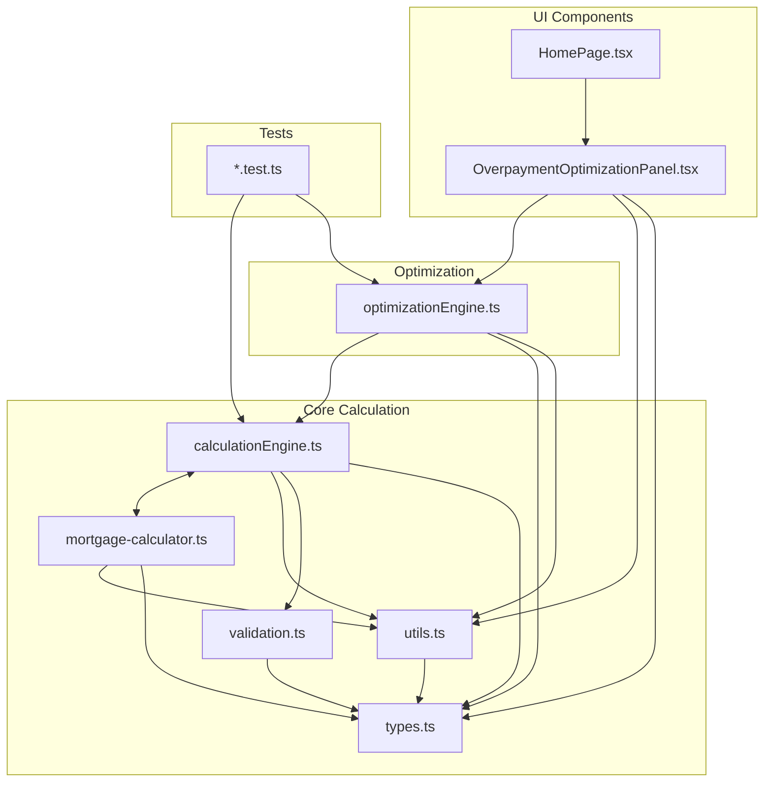
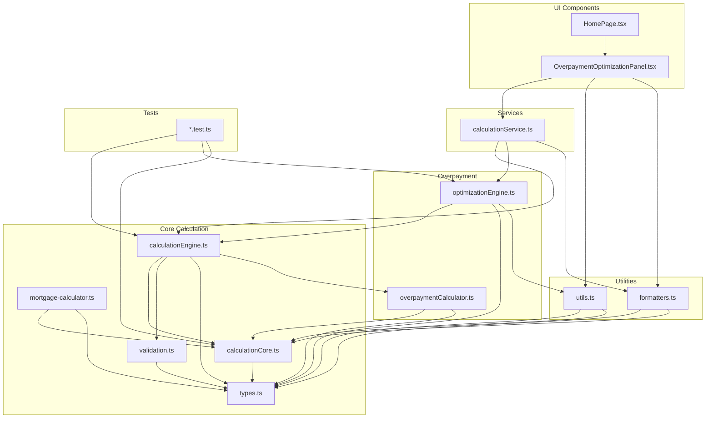

# Architecture Visualization: Current vs. Target

## Current Architecture

The current architecture has several issues including circular dependencies and mixed concerns:

## Target Architecture

The target architecture breaks circular dependencies and separates concerns:

## Key Improvements

1. **Breaking Circular Dependencies**
   - Extracted shared logic to `calculationCore.ts`
   - `calculationEngine.ts` and `mortgage-calculator.ts` now depend on the core module

2. **Separation of Concerns**
   - Calculation logic in `calculationCore.ts` and `calculationEngine.ts`
   - Formatting logic in `formatters.ts`
   - Overpayment logic in `overpaymentCalculator.ts`

3. **Service Layer**
   - Added `calculationService.ts` to mediate between UI and calculation logic
   - UI components no longer directly depend on calculation engines

4. **Clearer Module Boundaries**
   - Grouped related functionality into logical modules
   - Each module has a clear, focused responsibility

## Implementation Phases

1. **Phase 1: Break Circular Dependencies**
   - Create `calculationCore.ts`
   - Update `calculationEngine.ts` and `mortgage-calculator.ts`

2. **Phase 2: Separate Calculation from Presentation**
   - Create `formatters.ts`
   - Update `utils.ts`
   - Remove formatting logic from calculation modules

3. **Phase 3: Extract Overpayment Logic**
   - Create `overpaymentCalculator.ts`
   - Move overpayment logic from `calculationEngine.ts`

4. **Phase 4: Introduce Service Layer**
   - Create `calculationService.ts`
   - Update UI components to use the service

5. **Phase 5: Refactor Parameter Handling**
   - Introduce parameter objects
   - Standardize function signatures

## Benefits of New Architecture

1. **Improved Maintainability**
   - Smaller, focused modules with clear responsibilities
   - Reduced coupling between components

2. **Better Testability**
   - Easier to test components in isolation
   - Clearer dependencies make mocking simpler

3. **Enhanced Extensibility**
   - Easier to add new features or modify existing ones
   - Clearer extension points for new functionality

4. **Reduced Risk**
   - Changes to one module have less impact on others
   - Better separation of concerns reduces side effects