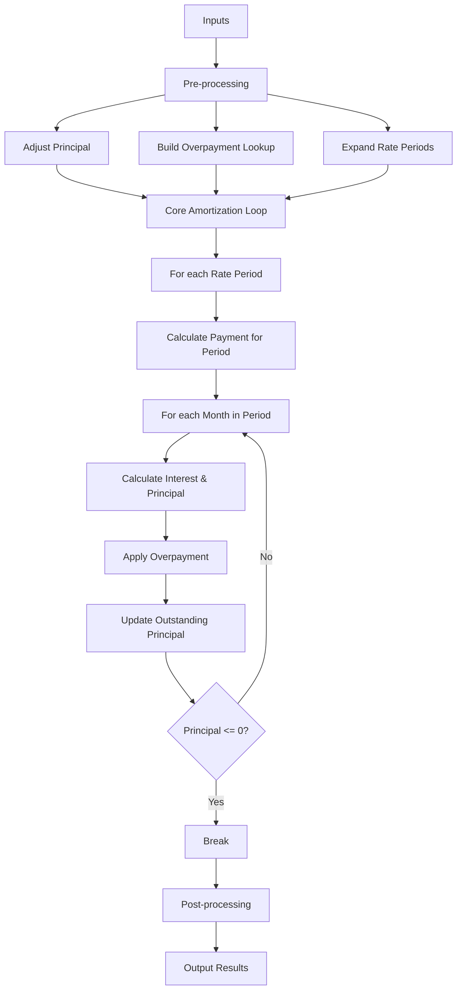
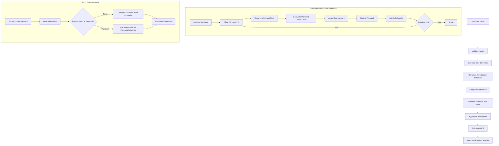
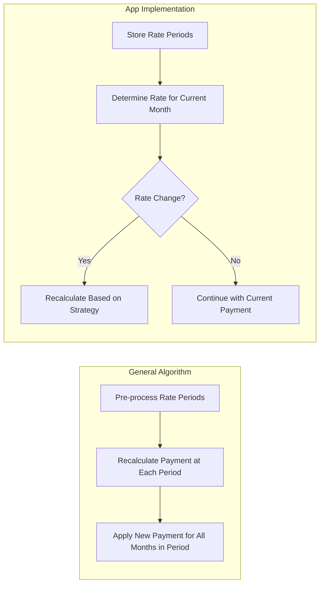
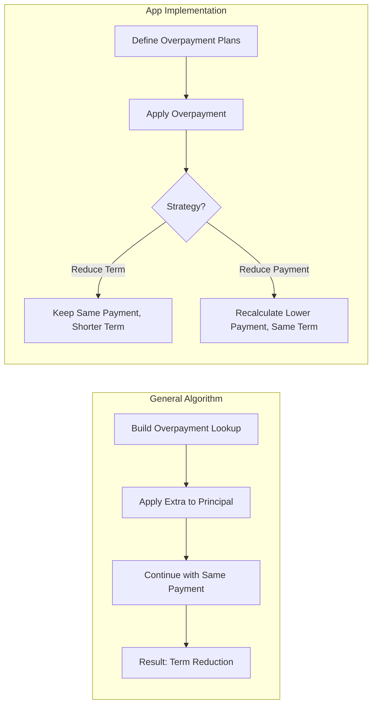

# Mortgage Calculation Algorithm Analysis

## 1. Introduction and Overview

Mortgage calculations are fundamental to financial planning and loan management. They involve determining payment schedules, interest costs, and the effects of various strategies like overpayments. This document provides a comprehensive comparison between the general-purpose algorithm described in mortgage-algorithm.md and the implementation in the mortgage calculator app, with a focus on identifying potential improvements.

Both approaches handle three key features of mortgage calculations:
- **Initial costs**: Fees and charges associated with setting up a mortgage
- **Multiple interest rate periods**: Changes in interest rates during the loan term
- **Overpayment strategies**: Additional payments to reduce the loan term or monthly payments

## 2. Core Algorithm Comparison

### 2.1 Basic Mortgage Formula

#### General Algorithm (mortgage-algorithm.md)

The general algorithm uses the standard annuity formula for calculating monthly payments:

```
if r_monthly > 0:
  Payment ← r_monthly * OutstandingPrincipal
             / (1 – (1 + r_monthly)^(-n))
else:
  Payment ← OutstandingPrincipal / n
```

This formula handles the edge case of zero interest rate by using simple division.

#### App Implementation

The app's implementation in `utils.ts` extends this approach with additional edge case handling:

```typescript
export function calculateMonthlyPayment(
  principal: number,
  monthlyRate: number,
  totalMonths: number
): number {
  // For extremely low rates (near-zero), use simple division
  if (Math.abs(monthlyRate) < 0.0001) {
    return roundToCents(principal / totalMonths);
  }
  
  // For very low rates, use simplified calculation
  if (monthlyRate < 0.001) {
    const totalPayment = principal * (1 + (monthlyRate * totalMonths));
    return roundToCents(totalPayment / totalMonths);
  }
  
  // Standard formula for normal interest rates
  const compoundFactor = Math.pow(1 + monthlyRate, totalMonths);
  const payment = principal * (monthlyRate * compoundFactor) / (compoundFactor - 1);
  return roundToCents(payment);
}
```

#### Comparison and Potential Improvements

The app's implementation provides enhanced numerical stability by:
1. Adding an intermediate case for very low (but non-zero) interest rates
2. Using a simplified calculation that avoids potential floating-point precision issues
3. Consistently rounding to cents for financial accuracy

**Potential Improvements:**
- Consider using a more robust numerical method for very high interest rates or extremely long terms
- Implement guard clauses to validate inputs (negative rates, zero principal, etc.)
- Add documentation explaining the mathematical reasoning behind the thresholds (0.0001 and 0.001)

### 2.2 Amortization Schedule Generation

#### General Algorithm

The general algorithm uses a nested loop structure:
1. Outer loop iterates through interest rate periods
2. Inner loop iterates through months within each period
3. For each month, it calculates interest and principal portions, applies overpayments, and updates the outstanding balance

```pseudocode
for each Period in PeriodSchedule:
  // Calculate payment for this period
  
  for m in Period.start … Period.end:
    // Calculate components for this month
    // Apply overpayment
    // Update outstanding principal
    // Record payment details
    
    if OutstandingPrincipal ≤ 0:
      break  // loan fully repaid
```

#### App Implementation

The app's implementation in `utils.ts` uses a single loop approach with conditional logic:

```typescript
while (remainingPrincipal > 0 && paymentNum <= originalTotalPayments) {
  // Determine the interest rate for the current payment
  let currentInterestRate = 0;
  for (const period of interestRatePeriods) {
    if (paymentNum >= period.startMonth) {
      currentInterestRate = period.interestRate;
    }
  }

  // Calculate payment components based on repayment model
  if (repaymentModel === 'decreasingInstallments') {
    // Decreasing installments calculation
  } else {
    // Equal installments calculation
  }

  // Apply overpayment if applicable
  
  // Adjust final payment if needed
  
  // Update remaining principal
  
  // Add to schedule
  
  paymentNum++;
  
  // Handle payment reduction if applicable
  
  // Safety checks
  if (paymentNum > 600) break;  // 50 years maximum
  if (remainingPrincipal < 0.01) break;  // Effectively zero
}
```

#### Comparison and Potential Improvements

The app's implementation differs in several ways:
1. Uses a single loop with conditional rate determination instead of nested loops
2. Supports multiple repayment models (equal installments and decreasing installments)
3. Includes safety checks to prevent infinite loops
4. Handles floating-point precision issues by checking for "effectively zero" balance

**Potential Improvements:**
- Refactor the single large loop into smaller, focused functions for better maintainability
- Add explicit handling for the final payment to ensure the balance reaches exactly zero
- Implement more sophisticated early termination logic based on financial thresholds
- Consider using a more functional approach with immutable data structures for better testability

## 3. Feature-by-Feature Comparison

### 3.1 Initial Costs Handling

#### General Algorithm

The general algorithm handles initial costs in the pre-processing stage:

```
if FinanceInitialCosts? then
  OutstandingPrincipal ← Principal + InitialCosts
else
  OutstandingPrincipal ← Principal
  UpfrontCostPaid ← InitialCosts
```

This approach is straightforward but limited to a binary choice: either finance all costs or pay all costs upfront.

#### App Implementation

The app's implementation in `calculationEngine.ts` provides more flexibility:

```typescript
export function calculateOneTimeFees(
  principal: number,
  additionalCosts?: AdditionalCosts
): number {
  if (!additionalCosts) return 0;

  let totalFees = 0;

  // Origination fee
  if (additionalCosts.originationFeeType === 'fixed') {
    totalFees += additionalCosts.originationFee;
  } else {
    totalFees += (principal * additionalCosts.originationFee / 100);
  }

  return roundToCents(totalFees);
}
```

The app also calculates APR to show the true cost of borrowing including all fees:

```typescript
export function calculateAPR(
  principal: number,
  monthlyPayment: number,
  loanTermMonths: number,
  oneTimeFees: number,
  recurringFees: number
): number {
  // Newton-Raphson method implementation
  // ...
}
```

#### Comparison and Potential Improvements

The app's implementation offers several advantages:
1. Supports both fixed and percentage-based fees
2. Separates one-time fees from recurring fees
3. Calculates APR to show the true cost of borrowing

**Potential Improvements:**
- Add support for more types of initial costs (application fees, legal fees, etc.)
- Implement a more granular approach to financing options (finance some fees but not others)
- Enhance the APR calculation to handle more complex fee structures
- Add visualization tools to show the impact of fees on the total cost of borrowing

### 3.2 Multiple Interest Rate Periods

#### General Algorithm

The general algorithm handles interest rate periods by:
1. Expanding rate periods into a schedule during pre-processing
2. Recalculating the payment amount at the start of each new rate period
3. Using the new payment amount for all months within that period

```
for each Period in PeriodSchedule:
  r_monthly ← Period.rate / PaymentFreqPerYear
  n ← Period.end – Period.start + 1
  
  // Compute new payment amount for this period
  if r_monthly > 0:
    Payment ← r_monthly * OutstandingPrincipal / (1 – (1 + r_monthly)^(-n))
  else:
    Payment ← OutstandingPrincipal / n
```

#### App Implementation

The app's implementation uses a different approach:

```typescript
// Determine the interest rate for the current payment
let currentInterestRate = 0;
for (const period of interestRatePeriods) {
  if (paymentNum >= period.startMonth) {
    currentInterestRate = period.interestRate;
  }
}
```

For complex scenarios with rate changes, the app uses a specialized function:

```typescript
export function recalculateScheduleWithNewRate(
  startingBalance: number,
  annualInterestRate: number,
  remainingTermInYears: number
): PaymentData[] {
  // Calculate new monthly payment
  // Generate new schedule with updated rate
  // ...
}
```

#### Comparison and Potential Improvements

The approaches differ significantly:
1. The general algorithm recalculates payments at each rate change
2. The app's implementation can either maintain the same payment (adjusting the term) or recalculate the payment (maintaining the term)

**Potential Improvements:**
- Implement a more flexible approach to rate changes that allows for different strategies at each change
- Add support for rate caps and floors in adjustable-rate mortgages
- Enhance visualization of how rate changes affect the loan over time
- Implement scenario analysis for potential future rate changes
- Add support for more complex rate structures (e.g., graduated payment mortgages)

### 3.3 Overpayment Strategies

#### General Algorithm

The general algorithm handles overpayments by:
1. Building a flat lookup of overpayment amounts per month during pre-processing
2. Applying the overpayment to the principal during the amortization loop
3. Continuing with the same payment amount (effectively reducing the term)

```
// Apply overpayment
extra ← Extra[m]
totalRepaid ← principalRepaid + extra
OutstandingPrincipal ← OutstandingPrincipal - totalRepaid
```

#### App Implementation

The app's implementation is more sophisticated:

```typescript
export function applyOverpayment(
  schedule: PaymentData[],
  overpaymentAmount: number,
  afterPayment: number,
  loanDetails: LoanDetails,
  effect: 'reduceTerm' | 'reducePayment'
): CalculationResults {
  // Apply overpayment
  // Recalculate remaining schedule based on effect
  // ...
}
```

The app supports both term reduction and payment reduction strategies:

```typescript
// Calculate remaining schedule based on effect
const remainingSchedule = effect === 'reduceTerm'
  ? calculateReducedTermSchedule(
    remainingBalance,
    interestRatePeriods,
    schedule[0].monthlyPayment,
    afterPayment + 1
  )
  : calculateReducedPaymentSchedule(
    remainingBalance,
    interestRatePeriods,
    schedule.length - afterPayment,
    schedule[0].monthlyPayment,
    afterPayment + 1
  );
```

#### Comparison and Potential Improvements

The app's implementation offers several advantages:
1. Supports both term reduction and payment reduction strategies
2. Handles one-time and recurring overpayments
3. Provides detailed analysis of the impact of overpayments

**Potential Improvements:**
- Implement more sophisticated overpayment strategies (e.g., bi-weekly payments)
- Add support for overpayment limits and penalties
- Enhance optimization algorithms to suggest optimal overpayment strategies
- Implement "what-if" analysis for different overpayment scenarios
- Add support for irregular overpayments based on cash flow projections

## 4. Implementation Analysis

### 4.1 Code Structure and Organization

#### General Algorithm

The general algorithm is presented as a single, cohesive pseudocode block with clear sections:
1. Inputs
2. Pre-processing
3. Core amortization loop
4. Post-processing & outputs

This structure is easy to understand and implement but lacks modularity.

#### App Implementation

The app's implementation is highly modular, with separate functions for:
- Basic calculations (`calculateMonthlyPayment`, `roundToCents`)
- Amortization schedule generation (`generateAmortizationSchedule`)
- Fee calculations (`calculateOneTimeFees`, `calculateRecurringFees`)
- Overpayment handling (`applyOverpayment`, `calculateReducedTermSchedule`)
- Interest rate changes (`recalculateScheduleWithNewRate`)
- Complex scenarios (`calculateComplexScenario`)

#### Comparison and Potential Improvements

The app's modular approach offers several advantages:
1. Better separation of concerns
2. Easier testing and maintenance
3. More flexibility for extending functionality

**Potential Improvements:**
- Further refactor large functions into smaller, more focused ones
- Implement a more consistent naming convention
- Add more comprehensive documentation for each module
- Consider using a more object-oriented or functional approach for better encapsulation
- Implement a facade pattern to simplify the API for common use cases

### 4.2 Data Models and Type Definitions

#### General Algorithm

The general algorithm uses simple data structures:
- Input parameters as primitive types
- Rate periods as tuples
- Overpayment rules as simple objects
- Schedule entries as records with named fields

#### App Implementation

The app uses TypeScript interfaces for strong typing:

```typescript
export interface LoanDetails {
  principal: number;
  interestRatePeriods: InterestRatePeriod[];
  loanTerm: number;
  overpaymentPlans: OverpaymentDetails[];
  startDate: Date;
  name: string;
  currency?: string;
  dateCreated?: string;
  repaymentModel?: RepaymentModel;
  additionalCosts?: AdditionalCosts;
}

export interface PaymentData {
  payment: number;
  monthlyPayment: number;
  principalPayment: number;
  interestPayment: number;
  balance: number;
  totalInterest: number;
  totalPayment: number;
  isOverpayment: boolean;
  overpaymentAmount: number;
  fees?: number;
  paymentDate?: Date;
  currency?: string;
  formattedValues?: Record<string, string>;
}
```

#### Comparison and Potential Improvements

The app's type system offers several advantages:
1. Strong typing prevents many runtime errors
2. Interfaces document the expected structure of data
3. Optional properties allow for flexibility

**Potential Improvements:**
- Use more immutable data structures to prevent unintended modifications
- Implement validation at the type level using branded types or refinement types
- Add more semantic types (e.g., `InterestRate` instead of `number`)
- Consider using a schema validation library for runtime validation
- Implement more comprehensive error types for better error handling

### 4.3 Edge Case Handling

#### General Algorithm

The general algorithm handles a few basic edge cases:
- Zero interest rate
- Loan fully repaid before the end of the term

#### App Implementation

The app handles numerous edge cases:
- Very low interest rates
- Final payment adjustments
- Floating-point precision issues
- Maximum term limits
- Validation of inputs

```typescript
// Handle edge cases
if (Math.abs(monthlyRate) < 0.0001) {
  return roundToCents(principal / totalMonths);
}

// Safety checks
if (paymentNum > 600) break;  // 50 years maximum
if (remainingPrincipal < 0.01) break;  // Effectively zero

// Adjust final payment
if (principalPayment > remainingPrincipal || paymentNum === originalTotalPayments) {
  principalPayment = remainingPrincipal;
  payment = principalPayment + interestPayment;
}
```

#### Comparison and Potential Improvements

The app's implementation is more robust in handling edge cases, but there are still areas for improvement:

**Potential Improvements:**
- Implement more comprehensive input validation
- Add explicit handling for negative interest rates (which can occur in some markets)
- Enhance error reporting with more descriptive messages
- Implement boundary testing for extreme values
- Add support for handling currency conversions and international mortgage types

## 5. Visual Representations

### 5.1 Algorithm Flowcharts

#### General Algorithm Flowchart



#### App Implementation Flowchart



### 5.2 Comparison Diagrams

#### Interest Rate Handling Comparison



#### Overpayment Strategy Comparison



## 6. Potential Improvements

### 6.1 Algorithmic Enhancements

1. **Improved Numerical Stability**
   - Implement more robust algorithms for extreme cases (very high rates, very long terms)
   - Use fixed-point arithmetic for financial calculations to avoid floating-point errors
   - Add comprehensive validation and boundary checking

2. **Performance Optimizations**
   - Implement memoization for repeated calculations
   - Use more efficient data structures for rate period lookups
   - Optimize loops and reduce unnecessary recalculations

3. **Enhanced Mathematical Models**
   - Support more sophisticated interest accrual methods (daily, continuous)
   - Implement more accurate APR calculations based on regulatory standards
   - Add support for non-standard compounding periods

### 6.2 Feature Extensions

1. **Additional Mortgage Types**
   - Interest-only periods
   - Balloon payments
   - Graduated payment mortgages
   - Negative amortization loans

2. **Enhanced Overpayment Options**
   - Bi-weekly payment schedules
   - Principal-only payments
   - Targeted principal reduction (e.g., reducing specific payments)
   - Overpayment limits and penalties

3. **Advanced Analysis Tools**
   - Sensitivity analysis for interest rate changes
   - Comparison of different mortgage products
   - Refinancing analysis
   - Tax impact calculations

### 6.3 Code Quality Improvements

1. **Refactoring Opportunities**
   - Break down large functions into smaller, more focused ones
   - Implement more consistent error handling
   - Improve naming conventions for better readability
   - Add more comprehensive documentation

2. **Testing Enhancements**
   - Implement property-based testing for mathematical correctness
   - Add more edge case tests
   - Implement performance benchmarks
   - Add visual regression testing for charts and reports

3. **Architecture Improvements**
   - Implement a more consistent domain model
   - Separate calculation logic from presentation
   - Use design patterns for better extensibility
   - Implement a plugin system for custom calculation strategies

## 7. Conclusion and Recommendations

The mortgage calculator app implements a robust and flexible approach to mortgage calculations, with several advantages over the general algorithm described in mortgage-algorithm.md. Key strengths include:

1. **Enhanced numerical stability** with special handling for edge cases
2. **Multiple repayment models** (equal and decreasing installments)
3. **Flexible fee structures** with both fixed and percentage-based options
4. **Comprehensive overpayment strategies** with term and payment reduction options
5. **Modular code structure** for better maintainability and extensibility

However, there are several opportunities for improvement:

### Priority Recommendations

1. **Refactor large functions** into smaller, more focused ones for better maintainability
2. **Enhance edge case handling** for extreme values and unusual scenarios
3. **Implement more sophisticated overpayment strategies** and optimization tools
4. **Add support for additional mortgage types** and features
5. **Improve documentation** with mathematical explanations and usage examples

By implementing these recommendations, the mortgage calculator app could become even more powerful and flexible, providing users with a comprehensive tool for mortgage analysis and planning.

## 8. Appendices

### Appendix A: Key Mathematical Formulas

#### Standard Mortgage Payment Formula

For a fixed-rate mortgage with equal installments:

$$M = P \frac{r(1+r)^n}{(1+r)^n-1}$$

Where:
- M = monthly payment
- P = principal
- r = monthly interest rate (annual rate / 12 / 100)
- n = total number of payments (term in years * 12)

#### Decreasing Installments Formula

For a mortgage with decreasing installments:

$$P_i = \frac{P}{n}$$
$$I_i = (P - \frac{P}{n} \times (i-1)) \times r$$
$$M_i = P_i + I_i$$

Where:
- P_i = principal portion of payment i
- I_i = interest portion of payment i
- M_i = total payment i
- P = original principal
- n = total number of payments
- r = monthly interest rate
- i = payment number

#### Annual Percentage Rate (APR)

The APR is calculated by finding the rate r that satisfies:

$$P - F = \sum_{i=1}^{n} \frac{M + R}{(1+r)^i}$$

Where:
- P = principal
- F = one-time fees
- M = monthly payment
- R = recurring monthly fees
- n = total number of payments
- r = monthly APR rate

### Appendix B: Code Comparison Examples

#### Monthly Payment Calculation

**General Algorithm:**
```
if r_monthly > 0:
  Payment ← r_monthly * OutstandingPrincipal
             / (1 – (1 + r_monthly)^(-n))
else:
  Payment ← OutstandingPrincipal / n
```

**App Implementation:**
```typescript
export function calculateMonthlyPayment(
  principal: number,
  monthlyRate: number,
  totalMonths: number
): number {
  // For extremely low rates (near-zero), use simple division
  if (Math.abs(monthlyRate) < 0.0001) {
    return roundToCents(principal / totalMonths);
  }
  
  // For very low rates, use simplified calculation
  if (monthlyRate < 0.001) {
    const totalPayment = principal * (1 + (monthlyRate * totalMonths));
    return roundToCents(totalPayment / totalMonths);
  }
  
  // Standard formula for normal interest rates
  const compoundFactor = Math.pow(1 + monthlyRate, totalMonths);
  const payment = principal * (monthlyRate * compoundFactor) / (compoundFactor - 1);
  return roundToCents(payment);
}
```

### Appendix C: Additional Resources

1. **Financial Mathematics References**
   - "The Mathematics of Finance" by Petr Zima and Robert L. Brown
   - "Financial Calculus" by Martin Baxter and Andrew Rennie

2. **Mortgage Industry Standards**
   - Consumer Financial Protection Bureau (CFPB) guidelines
   - European Standardised Information Sheet (ESIS) requirements

3. **Numerical Methods**
   - "Numerical Recipes" by Press, Teukolsky, Vetterling, and Flannery
   - "Numerical Methods for Finance" by John A. D. Appleby et al.