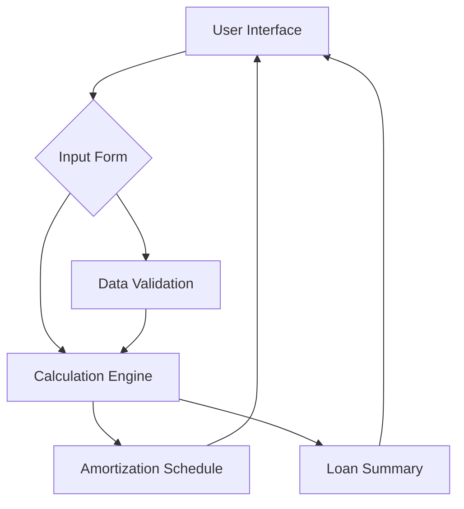

# Mortgage Calculator Review and Improvement Plan

## Goals

*   Check for potential business functionalities to add.
*   Focus on both a general review and the calculation formulas.
*   Review the front-end side to ensure it supports multiple periods or overpaying options.

## Plan

### Back-End (Calculation Engine) Improvements

1.  **[x] Eliminate Duplication:** [x]
    *   [x] Move the `calculateMonthlyPayment` and `generateAmortizationSchedule` functions to a common utility file (e.g., `client/src/lib/utils.ts`) and import them where needed.
    *   [x] Ensure that the tests are updated to use the consolidated functions.
2.  **Standardize Overpayment Handling:** [x]
    *   Review the overpayment logic in both `calculationEngine.ts` and `mortgage-calculator.ts` and identify any inconsistencies.
    *   Consolidate the overpayment logic into a single, well-tested function.
3.  **Improve Input Validation:**
    *   Review the input validation logic in both `calculationEngine.ts` and `mortgage-calculator.ts` and identify any gaps.
    *   Implement more robust input validation to prevent errors and potential security vulnerabilities.
4.  **Implement Advanced Features (in `calculationEngine.ts`):**
    *   Add support for ARMs by modifying the `calculateMonthlyPayment` and `generateAmortizationSchedule` functions to handle changing interest rates over time.
    *   Add support for property tax and insurance payments by adding new input parameters and modifying the `calculateMonthlyPayment` and `generateAmortizationSchedule` functions to include these costs.
    *   Add support for different compounding periods by modifying the `calculateMonthlyPayment` function to handle different compounding frequencies.
    *   Add support for multiple overpayment plans by modifying the `calculateLoanDetails` and `generateScheduleWithRecurringOverpayments` functions to handle multiple `OverpaymentDetails` objects.
5.  **Improve Test Coverage:**
    *   Review the existing tests and identify any gaps in coverage.
    *   Write new tests to cover all edge cases and potential error conditions.
6.  **Improve Documentation:**
    *   Add JSDoc comments to all functions and classes to explain their purpose and usage.
7. **Reduce file size**
    * Refactor solution - especially large files like engine to be smaller and easier to digest. Max of 400 lines of code

### Front-End Improvements

1.  **Update Data Types:**
    *   Modify the `LoanDetails` type to include an array of interest rate periods, where each period has a start month and an interest rate.
    *   Modify the `LoanDetails` type to include an array of overpayment plans, where each plan has an amount, start month, end month (optional), frequency, and effect.
2.  **Update Loan Input Form:**
    *   Modify the `LoanInputForm.tsx` component to allow the user to enter multiple interest rate periods. This could be done using a dynamic form with "Add Period" and "Remove Period" buttons.
    *   Modify the `LoanInputForm.tsx` component to allow the user to enter multiple overpayment plans. This could be done using a dynamic form with "Add Overpayment" and "Remove Overpayment" buttons.
3.  **Update Overpayment Section:**
    *   Remove the `OverpaymentSection.tsx` component, as the overpayment functionality will be integrated into the `LoanInputForm.tsx` component.
4.  **Update Amortization Schedule:**
    *   Modify the `AmortizationSchedule.tsx` component to display information about interest rate periods and overpayment plans. This might require adding new columns to the table or using a more complex data visualization.
5.  **Update Loan Summary:**
    *   Modify the `LoanSummary.tsx` component to display information about interest rate periods and overpayment plans. This might require adding new sections to the component or using a more complex data visualization.
6.  **Update Calculator Form:**
    *   Modify the `client/src/components/mortgage-calculator/calculator-form.tsx` component to use the updated `LoanDetails` type and to handle multiple interest rate periods and overpayment plans.
7.  **Integrate with Calculation Engine:**
    *   Modify the front-end components to pass the necessary data to the calculation engine.
    *   Ensure that the front-end components can properly display the results returned by the calculation engine.
8.  **Test Thoroughly:**
    *   Test the front-end components with a variety of mortgage scenarios to ensure that they are working correctly.
    *   Pay close attention to the user experience and make sure that the front-end is easy to use and understand.
9.  **Update Documentation:**
    *   Update the documentation to reflect the changes made to the front-end components.
    *   Provide clear instructions on how to use the new features.

## Architecture Diagrams

### Overall Architecture



### Front-End Improvement Plan

```mermaid
graph TD
    A[Initial Front-End] --> B{Analyze Components};
    B --> C{Update Data Types};
    C --> D[Update Loan Input Form];
    C --> E[Update Amortization Schedule];
    C --> F[Update Loan Summary];
    D --> G[Integrate with Calculation Engine];
    E --> G;
    F --> G;
    G --> H[Test Thoroughly];
    H --> I[Update Documentation];
    I --> J[Final Front-End];