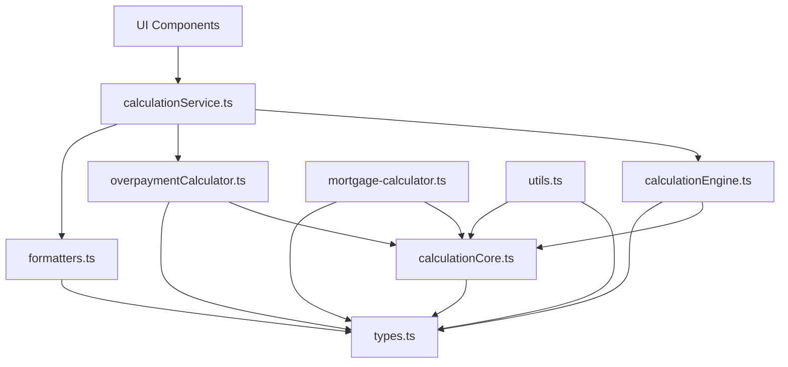

# Mortgage Calculator Refactoring Review

## Overview

This document provides a comprehensive review of the refactoring work that has been done based on the recommendations in the `/refactor/` folder. It identifies which components have been properly updated to use the new architecture and which files and methods are now outdated and can be removed.

## Implemented Refactoring Changes

The refactoring has successfully implemented several key architectural improvements:

1. **Breaking Circular Dependencies**
   - Created `calculationCore.ts` to extract shared logic between `calculationEngine.ts` and `mortgage-calculator.ts`
   - Implemented core calculation functions like `calculateBaseMonthlyPayment` and `roundToCents` in the core module

2. **Separation of Concerns**
   - Created `formatters.ts` to separate formatting logic from calculation logic
   - Extracted overpayment logic into a dedicated `overpaymentCalculator.ts` module
   - Implemented a service layer with `calculationService.ts` to mediate between UI and calculation logic

3. **Improved Parameter Handling**
   - Implemented parameter objects for function calls to improve readability and maintainability
   - Added backward compatibility wrappers to ensure existing code continues to work

4. **Enhanced Modularity**
   - Clearly defined responsibilities for each module
   - Improved testability by separating concerns

## Outdated Files and Methods

### Outdated Methods in utils.ts

The following methods in `utils.ts` are now outdated and should be removed as they have been moved to dedicated modules:

1. **Calculation Methods (moved to calculationCore.ts)**
   - `calculateMonthlyPayment` (now a wrapper around `calculateBaseMonthlyPayment`)
   - `roundToCents` (now a wrapper around the core function)
   - `calculateReducedTermSchedule` (moved to overpaymentCalculator.ts)
   - `calculateReducedPaymentSchedule` (moved to overpaymentCalculator.ts)

2. **Formatting Methods (moved to formatters.ts)**
   - `formatCurrency` (re-exported from formatters.ts)
   - `formatDate` (re-exported from formatters.ts)
   - `formatTimePeriod` (re-exported from formatters.ts)
   - `formatDateLegacy` (re-exported from formatters.ts)

3. **Complex Logic (should be moved to dedicated modules)**
   - `generateAmortizationSchedule` (should be moved to calculationEngine.ts or a dedicated module)

### Outdated Methods in calculationEngine.ts

The following methods in `calculationEngine.ts` are now outdated:

1. **Core Calculation Methods (moved to calculationCore.ts)**
   - `calculateMonthlyPaymentInternal` (replaced by `calculateBaseMonthlyPayment`)
   - `convertAndProcessSchedule` (should use `convertScheduleFormat` from calculationCore.ts)

2. **Overpayment Methods (moved to overpaymentCalculator.ts)**
   - `applyOverpayment`
   - `applyMultipleOverpayments`
   - Any other overpayment-related functions

### Outdated Methods in mortgage-calculator.ts

The following methods in `mortgage-calculator.ts` are now outdated:

1. **Conversion Methods (moved to calculationCore.ts)**
   - `convertLegacySchedule` (replaced by `convertScheduleFormat`)

## Front-end Component Updates Needed

The following components still need to be updated to use the new service layer:

1. **Components using calculationEngine directly:**
   - `HomePage.tsx` - Still imports `calculateLoanDetails` from calculationEngine

2. **Components using utils.ts formatting functions:**
   - `ScenarioComparison.tsx`
   - `mortgage-calculator/visualization.tsx`
   - `mortgage-calculator/saved-calculations-modal.tsx`
   - `mortgage-calculator/payment-summary.tsx`
   - `mortgage-calculator/amortization-schedule.tsx`
   - `LoanSummary.tsx`
   - `LoanInputForm.tsx`
   - `ExportPanel.tsx`
   - `ChartSection.tsx`
   - `AmortizationSchedule.tsx`

3. **Components already using calculationService:**
   - `OverpaymentOptimizationPanel.tsx` - Correctly using the service layer

## Recommended Next Steps

1. **Update UI Components**
   - Modify all UI components to use the calculationService instead of direct calculation functions
   - Update import statements to use the new module structure

2. **Clean Up Outdated Methods**
   - Remove deprecated methods after ensuring all components are using the new structure
   - Maintain backward compatibility wrappers until all components are updated

3. **Complete the Refactoring**
   - Move `generateAmortizationSchedule` from utils.ts to a more appropriate module
   - Ensure all tests are updated to use the new module structure

## Architecture Diagram

This diagram shows the new dependency structure, with the service layer mediating between UI components and the calculation modules, and the core calculation module being used by both the calculation engine and mortgage calculator.

## Conclusion

The refactoring has made significant progress in improving the architecture of the mortgage calculator application. The main architectural issues have been addressed, including breaking circular dependencies and separating concerns. However, there is still work to be done to fully adopt the new architecture throughout the codebase, particularly in updating UI components to use the service layer and removing outdated methods.