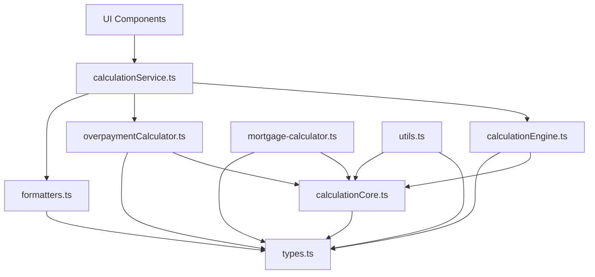

# Mortgage Calculator Refactoring Summary

## Overview

This document summarizes the findings from our review of the refactoring work that has been done based on the recommendations in the `/refactor/` folder. It provides a clear path forward for completing the refactoring process and ensuring all components are using the new architecture.

## Current Status

The refactoring has made significant progress in improving the architecture of the mortgage calculator application:

✅ **Breaking Circular Dependencies**: Created `calculationCore.ts` to extract shared logic between `calculationEngine.ts` and `mortgage-calculator.ts`

✅ **Separation of Concerns**: Created dedicated modules for different responsibilities:
  - `formatters.ts` for formatting logic
  - `overpaymentCalculator.ts` for overpayment-specific logic
  - `calculationService.ts` for the service layer

✅ **Improved Parameter Handling**: Implemented parameter objects for function calls

✅ **Enhanced Modularity**: Clearly defined responsibilities for each module

However, there are still areas that need attention:

❌ **UI Components**: Most UI components still directly import from `utils.ts` or `calculationEngine.ts` instead of using the service layer

❌ **Outdated Methods**: Several methods in `utils.ts`, `calculationEngine.ts`, and `mortgage-calculator.ts` are now outdated but still present

## Recommended Action Plan

### Phase 1: Update UI Components (2-3 days)

1. Update all UI components to use the calculationService or formatters module
   - Start with HomePage.tsx which directly uses calculationEngine.ts
   - Then update components using formatting functions from utils.ts
   - Follow the detailed plan in `component-update-plan.md`

2. Test each component after updating to ensure functionality is preserved
   - Run unit tests
   - Manually verify UI rendering and functionality

### Phase 2: Clean Up Outdated Methods (1-2 days)

1. Once all components are updated, remove redundant methods from:
   - utils.ts
   - calculationEngine.ts
   - mortgage-calculator.ts

2. Follow the detailed list in `outdated-files-methods.md`

3. Keep re-export statements for backward compatibility if needed

### Phase 3: Final Cleanup and Documentation (1 day)

1. Move `generateAmortizationSchedule` from utils.ts to a more appropriate module

2. Update documentation to reflect the new architecture

3. Ensure all tests are passing

## Architecture Diagram

## Benefits of Completing the Refactoring

1. **Improved Maintainability**: Clearer function signatures and better organization

2. **Enhanced Testability**: More modular code that's easier to test

3. **Better Error Handling**: Consistent error handling and validation

4. **Reduced Coupling**: Clearer separation of concerns and dependencies

5. **Easier Onboarding**: More intuitive code structure for new developers

## Risks and Mitigation

1. **Risk**: Breaking changes in UI components
   **Mitigation**: Thorough testing after each component update

2. **Risk**: Performance regression
   **Mitigation**: Benchmark before and after refactoring

3. **Risk**: Missing dependencies when removing methods
   **Mitigation**: Incremental approach with testing at each step

## Conclusion

The refactoring has made significant progress in improving the architecture of the mortgage calculator application. By following the recommended action plan, we can complete the refactoring process and fully realize the benefits of the new architecture. The most critical next step is updating the UI components to use the service layer, which will allow us to safely remove the outdated methods and complete the refactoring.

## Related Documents

- [Refactoring Review](./refactoring-review.md) - Comprehensive review of the refactoring work
- [Outdated Files and Methods](./outdated-files-methods.md) - Detailed list of outdated files and methods
- [Component Update Plan](./component-update-plan.md) - Step-by-step plan for updating UI components