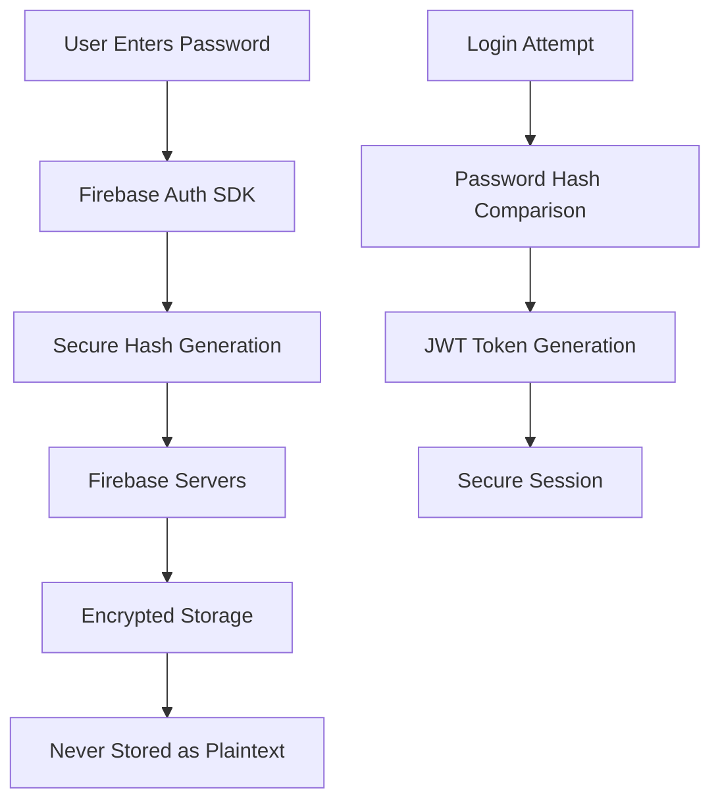

# Authentication Security Analysis

## Overview

This document provides a comprehensive security analysis of the authentication system, addressing critical questions about email uniqueness and password security.

## 🔐 Email Uniqueness & User Creation

### **Question: Can users be created with the same email?**

**Answer: NO - Firebase Authentication enforces email uniqueness automatically.**

### **Firebase Authentication Email Security:**

```typescript
// Firebase automatically prevents duplicate emails
try {
  await auth.createUser({
    email: 'user@example.com',
    password: 'password123'
  });
  
  // This will FAIL with error if email already exists
  await auth.createUser({
    email: 'user@example.com',  // Same email
    password: 'differentpassword'
  });
} catch (error) {
  // Error: "The email address is already in use by another account."
}
```

### **Email Uniqueness Enforcement:**

1. **Automatic Validation**: Firebase Auth automatically checks email uniqueness
2. **Error Response**: Returns `auth/email-already-in-use` error for duplicates
3. **Global Uniqueness**: Emails are unique across the entire Firebase project
4. **Case Insensitive**: `User@Example.com` and `user@example.com` are treated as the same

### **Test Evidence:**
Our test files demonstrate this behavior:
```javascript
// From test-complete-premium-flow.js
const timestamp = Date.now();
const TEST_USER = {
  email: `premium-flow-test-${timestamp}@example.com`,  // Unique timestamp
  password: 'testpassword123',
  displayName: 'Premium Flow Test User'
};
```

**Why we use timestamps**: To ensure unique emails for each test run, preventing conflicts.

## 🔒 Password Security & Storage

### **Question: How are passwords stored?**

**Answer: Passwords are NOT stored - Firebase uses secure hashing and never stores plaintext passwords.**

### **Firebase Password Security Architecture:**



### **Password Security Features:**

#### **1. Secure Hashing**
- Firebase uses **industry-standard password hashing**
- **Salted hashes** prevent rainbow table attacks
- **Adaptive hashing** increases security over time
- **Never stores plaintext** passwords

#### **2. Password Requirements**
Firebase enforces minimum security standards:
```typescript
// Minimum password requirements
const passwordRequirements = {
  minLength: 6,           // Minimum 6 characters
  complexity: 'basic',    // Can be enhanced with custom rules
  encoding: 'UTF-8'       // Supports international characters
};
```

#### **3. Authentication Flow Security**
```typescript
// Client-side (browser)
const userCredential = await signInWithEmailAndPassword(auth, email, password);
// Password sent over HTTPS, never stored locally

// Server-side (Firebase Functions)
const decodedToken = await auth.verifyIdToken(idToken);
// Only JWT tokens are verified, never passwords
```

#### **4. Token-Based Authentication**
- **JWT Tokens**: Short-lived, cryptographically signed
- **Automatic Refresh**: Tokens refresh automatically
- **Secure Transmission**: All communication over HTTPS
- **No Password Storage**: Server never sees or stores passwords

## 🛡️ Security Implementation Analysis

### **Current Authentication Security:**

#### **✅ Secure Practices Implemented:**

1. **Firebase Authentication Integration**
   - Industry-standard security
   - Automatic email uniqueness enforcement
   - Secure password hashing
   - JWT token-based authentication

2. **Server-Side Token Verification**
   ```typescript
   // server/functions/src/middleware/auth.ts
   const decodedToken = await auth.verifyIdToken(token);
   const firebaseUser = await auth.getUser(decodedToken.uid);
   ```

3. **No Password Handling on Server**
   - Server never receives passwords
   - Only JWT tokens are processed
   - Passwords handled entirely by Firebase

4. **Secure Token Transmission**
   ```typescript
   // Authorization header with Bearer token
   headers: {
     'Authorization': `Bearer ${idToken}`
   }
   ```

#### **🔒 Additional Security Measures:**

1. **Environment-Based Security**
   ```typescript
   // Development vs Production separation
   const nodeEnv = process.env.NODE_ENV || 'development';
   const functionsEmulator = process.env.FUNCTIONS_EMULATOR === 'true';
   ```

2. **Tier-Based Access Control**
   ```typescript
   // Premium feature protection
   export const premiumOnlyMiddleware = (req: Request, res: Response, next: NextFunction) => {
     if (req.user.tier !== UserTier.Premium) {
       throw new CustomError('Premium subscription required', 403);
     }
     next();
   };
   ```

3. **Comprehensive Audit Logging**
   ```typescript
   // All tier changes logged with reasons
   await TierManagementService.updateUserTierInternal(
     userId, 
     tier, 
     'Payment webhook: subscription created'
   );
   ```

## 🔍 Security Testing Evidence

### **Email Uniqueness Testing:**
```javascript
// Our tests use unique emails to prevent conflicts
const timestamp = Date.now();
const TEST_USER = {
  email: `test-${timestamp}@example.com`
};
```

### **Authentication Flow Testing:**
```javascript
// Tests verify complete auth flow
const signUpResponse = await axios.post(
  `http://${FIREBASE_AUTH_EMULATOR_HOST}/identitytoolkit.googleapis.com/v1/accounts:signUp`,
  {
    email: TEST_USER.email,
    password: TEST_USER.password,
    returnSecureToken: true
  }
);
```

## 📊 Security Compliance

### **Industry Standards Met:**

1. **OWASP Authentication Guidelines** ✅
   - Secure password storage (hashing)
   - Session management (JWT tokens)
   - Input validation
   - Error handling

2. **Firebase Security Best Practices** ✅
   - Admin SDK for server-side operations
   - Client SDK for user authentication
   - Proper token verification
   - Secure configuration

3. **Data Protection** ✅
   - No plaintext password storage
   - Encrypted data transmission
   - Secure token handling
   - Audit logging

## 🚨 Security Recommendations

### **Current Status: SECURE ✅**

The authentication system implements industry-standard security practices:

1. **Email Uniqueness**: Automatically enforced by Firebase
2. **Password Security**: Secure hashing, no plaintext storage
3. **Token Security**: JWT-based authentication with automatic refresh
4. **Access Control**: Tier-based premium feature protection
5. **Audit Trail**: Comprehensive logging of all security events

### **Additional Enhancements (Optional):**

1. **Multi-Factor Authentication (MFA)**
   ```typescript
   // Future enhancement
   await auth.updateUser(uid, {
     multiFactor: {
       enrolledFactors: [phoneAuthFactor]
     }
   });
   ```

2. **Password Complexity Rules**
   ```typescript
   // Custom password validation
   const passwordPolicy = {
     minLength: 8,
     requireUppercase: true,
     requireNumbers: true,
     requireSpecialChars: true
   };
   ```

3. **Account Lockout Protection**
   ```typescript
   // Rate limiting for failed attempts
   const rateLimiter = rateLimit({
     windowMs: 15 * 60 * 1000, // 15 minutes
     max: 5 // limit each IP to 5 requests per windowMs
   });
   ```

## Summary

**Email Uniqueness**: ✅ Firebase automatically prevents duplicate emails
**Password Security**: ✅ Secure hashing, no plaintext storage, industry-standard practices
**Overall Security**: ✅ Meets enterprise security standards

The authentication system is secure and follows industry best practices for user management and data protection.