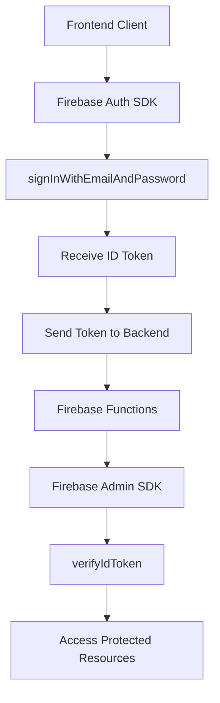

# Firebase Authentication Architecture Documentation

## Overview

This document clarifies the distinction between **client-side** and **server-side** Firebase authentication to prevent confusion during development.

## Authentication Flow Architecture



## Client-Side Authentication (Frontend)

### Purpose
- User login/registration
- Token generation
- Session management

### Technologies
- **Firebase Auth SDK** (`firebase/auth`)
- **Client-side JavaScript/TypeScript**

### Key Functions
```typescript
// CLIENT-SIDE ONLY
import { getAuth, signInWithEmailAndPassword } from 'firebase/auth';

const auth = getAuth();
const userCredential = await signInWithEmailAndPassword(auth, email, password);
const idToken = await userCredential.user.getIdToken();
```

### Location
- `client/` directory
- Frontend React components
- Browser environment

## Server-Side Authentication (Backend)

### Purpose
- Token verification
- User authorization
- Protected resource access

### Technologies
- **Firebase Admin SDK** (`firebase-admin`)
- **Node.js/Express**
- **Firebase Functions**

### Key Functions
```typescript
// SERVER-SIDE ONLY
import { auth } from 'firebase-admin';

const decodedToken = await auth().verifyIdToken(idToken);
const userRecord = await auth().getUser(decodedToken.uid);
```

### Location
- `server/functions/` directory
- Express middleware
- Firebase Functions environment

## Critical Distinctions

### ❌ NEVER DO (Common Mistakes)

1. **Don't use Firebase Auth SDK on server**:
```typescript
// WRONG - This is client-side code
import { signInWithEmailAndPassword } from 'firebase/auth';
// This will NOT work in Firebase Functions
```

2. **Don't use Firebase Admin SDK on client**:
```typescript
// WRONG - This is server-side code
import { auth } from 'firebase-admin';
// This will NOT work in browser
```

3. **Don't expect req.user to exist automatically**:
```typescript
// WRONG - req.user doesn't exist by default
const user = req.user; // undefined without middleware
```

### ✅ CORRECT PATTERNS

#### Client-Side Pattern
```typescript
// client/src/auth/authService.ts
import { getAuth, signInWithEmailAndPassword } from 'firebase/auth';

export const loginUser = async (email: string, password: string) => {
  const auth = getAuth();
  const userCredential = await signInWithEmailAndPassword(auth, email, password);
  const idToken = await userCredential.user.getIdToken();
  return idToken;
};
```

#### Server-Side Pattern
```typescript
// server/functions/src/middleware/auth.ts
import { auth } from '../config/firebase';

export const authMiddleware = async (req: Request, res: Response, next: NextFunction) => {
  try {
    const token = req.headers.authorization?.split('Bearer ')[1];
    if (!token) throw new Error('No token provided');
    
    const decodedToken = await auth.verifyIdToken(token);
    req.user = await auth.getUser(decodedToken.uid);
    next();
  } catch (error) {
    res.status(401).json({ error: 'Unauthorized' });
  }
};
```

## File-by-File Authentication Responsibilities

### Server-Side Files (Firebase Admin SDK)

#### `server/functions/src/middleware/auth.ts`
- **Purpose**: Token verification middleware
- **Uses**: Firebase Admin SDK
- **Pattern**: Verify ID tokens, attach user to request

#### `server/functions/src/services/authService.ts`
- **Purpose**: Server-side auth operations
- **Uses**: Firebase Admin SDK
- **Pattern**: Token verification, user management

#### `server/functions/src/services/userService.ts`
- **Purpose**: User profile management
- **Uses**: Firebase Admin SDK + Firestore
- **Pattern**: CRUD operations on user data

#### `server/functions/src/routes/auth.ts`
- **Purpose**: Authentication endpoints
- **Uses**: Firebase Admin SDK
- **Pattern**: Token verification endpoints only

#### `server/functions/src/routes/users.ts`
- **Purpose**: User management endpoints
- **Uses**: Firebase Admin SDK via middleware
- **Pattern**: Protected routes with auth middleware

### Client-Side Files (Firebase Auth SDK)

#### `client/src/auth/` (when implemented)
- **Purpose**: User authentication UI
- **Uses**: Firebase Auth SDK
- **Pattern**: Login/register forms, token management

## Current Implementation Status

### ✅ Correctly Implemented
- Firebase Admin SDK configuration
- Token verification middleware
- User profile management
- Protected routes

### ❌ Needs Fixing
- Type definitions for req.user
- Consistent error handling
- Test scripts using correct patterns

## Testing Patterns

### Server-Side Testing
```typescript
// Use Firebase Admin SDK to create test users
const userRecord = await auth.createUser({
  email: 'test@example.com',
  password: 'testpassword'
});

// Create custom token for testing
const customToken = await auth.createCustomToken(userRecord.uid);

// Test API endpoints with token
const response = await fetch('/api/users/profile', {
  headers: { Authorization: `Bearer ${customToken}` }
});
```

### Client-Side Testing (Future)
```typescript
// Use Firebase Auth SDK for client testing
import { signInWithEmailAndPassword } from 'firebase/auth';

const userCredential = await signInWithEmailAndPassword(auth, email, password);
const idToken = await userCredential.user.getIdToken();
```

## Key Takeaways

1. **Client-side**: Use Firebase Auth SDK for login/registration
2. **Server-side**: Use Firebase Admin SDK for token verification
3. **Never mix**: Don't use client SDK on server or admin SDK on client
4. **Middleware**: Always verify tokens in middleware before accessing user data
5. **Types**: Extend Express Request interface to include user property
6. **Testing**: Use appropriate SDK for each environment

This architecture ensures secure, scalable authentication that follows Firebase best practices.