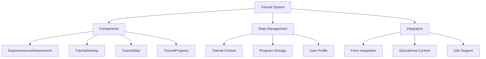
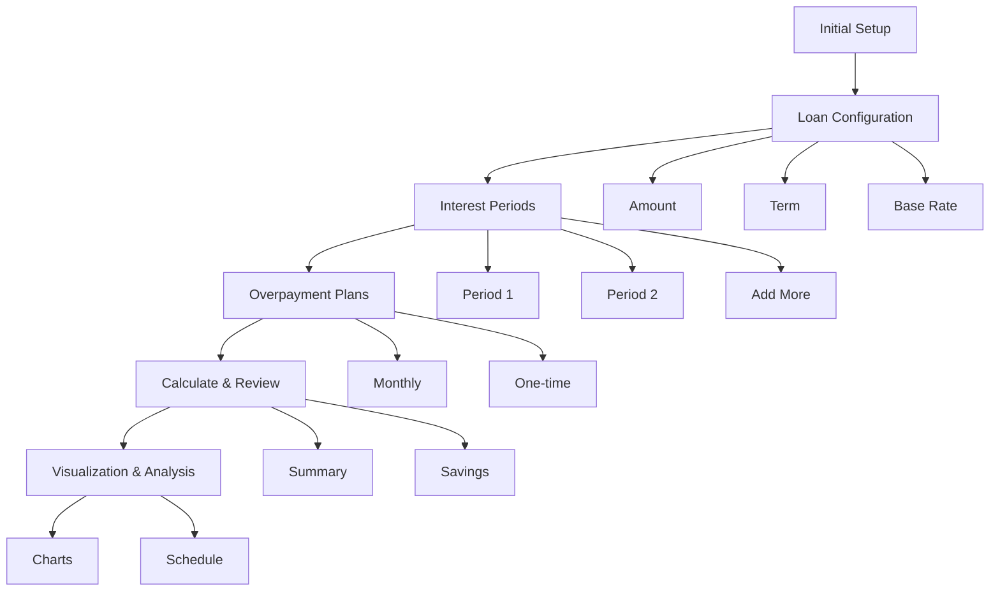
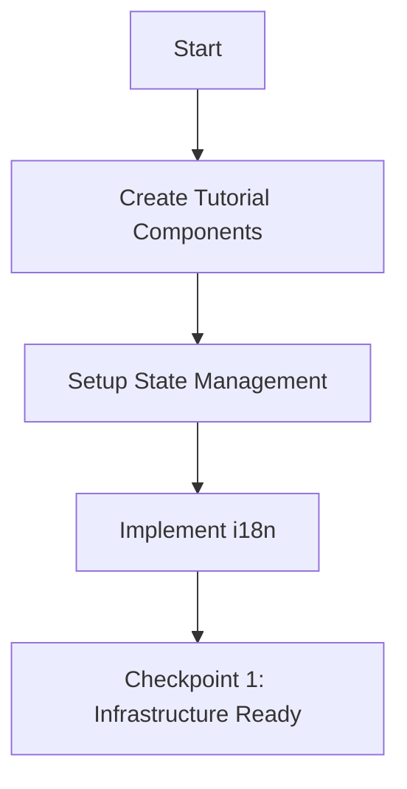
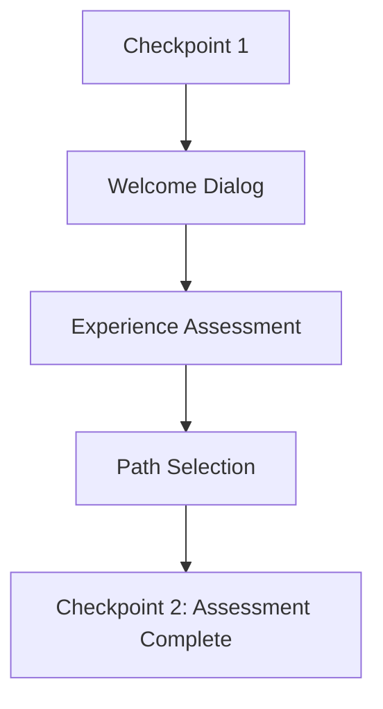
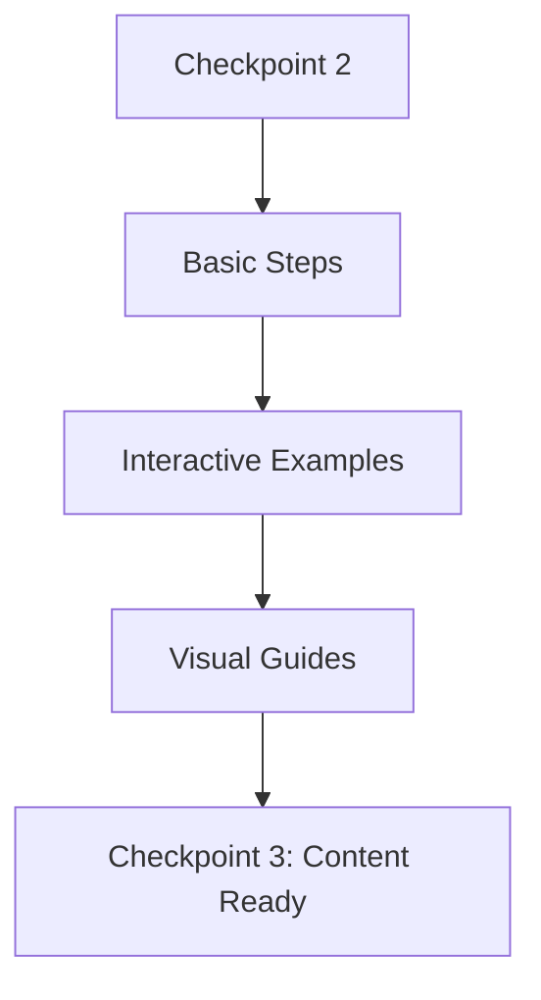
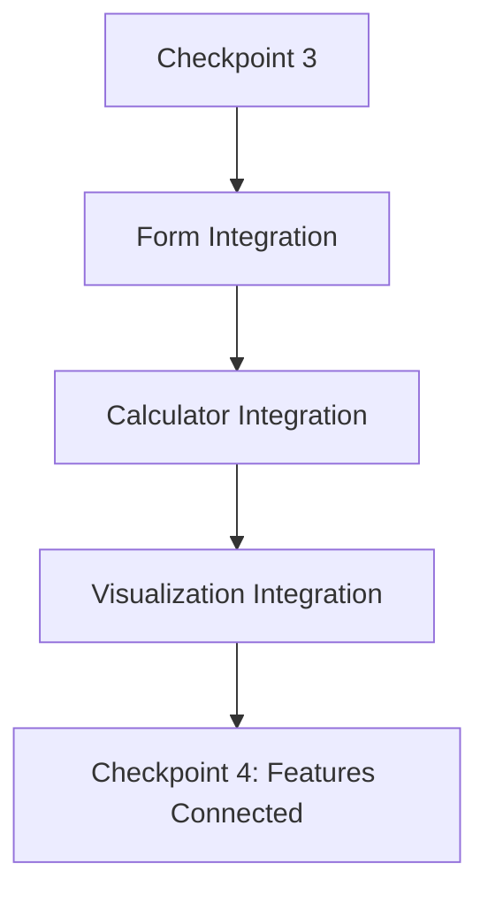

# Tutorial Implementation Plan

## Overview
This plan outlines the implementation of an interactive tutorial system that guides users through the mortgage calculator, with personalized paths based on user experience level and comprehensive integration with existing educational content.

## Architecture



## Experience Level Assessment

### Welcome Dialog
```typescript
interface ExperienceLevel {
  level: 'beginner' | 'intermediate' | 'advanced';
  preferences: {
    detailLevel: 'basic' | 'detailed';
    includeExamples: boolean;
    showCalculations: boolean;
  };
}
```

### Friendly Welcome Message Examples
1. **Initial Greeting**
   ```
   "Welcome to Your Mortgage Calculator! 👋
   We're here to help you understand your mortgage options.
   To provide the best guidance, we'd love to know a bit about your experience."
   ```

2. **Experience Assessment**
   - Question: "How familiar are you with mortgage calculations?"
   - Options:
     ```
     🌱 "I'm new to this - please guide me through everything"
     📚 "I know the basics but want to learn more"
     🎓 "I'm experienced and just need quick references"
     ```

## Real-World Guided Scenario

### Complete Mortgage Journey


### Step-by-Step Guide

1. **Loan Amount Configuration**
   ```typescript
   const loanSetupStep = {
     title: "Setting Up Your Loan",
     example: {
       homePrice: 400000,
       downPayment: 80000,
       loanAmount: 320000,
       explanation: "With a 20% down payment on a $400,000 home, your loan amount would be $320,000"
     }
   };
   ```

2. **Loan Term Selection**
   ```typescript
   const loanTermStep = {
     title: "Choosing Your Loan Term",
     comparison: {
       "30-year": {
         payment: "$1,527/month",
         totalInterest: "$229,720"
       },
       "15-year": {
         payment: "$2,372/month",
         totalInterest: "$106,960"
       }
     }
   };
   ```

3. **Interest Rate Configuration**
   ```typescript
   const interestRateStep = {
     title: "Setting Up Interest Rates",
     periods: [
       {
         years: "1-5",
         rate: "3.5%",
         payment: "$1,437/month"
       },
       {
         years: "6-30",
         rate: "4.5%",
         payment: "$1,520/month"
       }
     ]
   };
   ```

4. **Overpayment Plans**
   ```typescript
   const overpaymentStep = {
     examples: [
       {
         type: "Monthly",
         amount: "$200/month",
         impact: {
           termReduction: "4 years",
           interestSaving: "$45,320"
         }
       },
       {
         type: "Annual",
         amount: "$5,000/year",
         impact: {
           termReduction: "6 years",
           interestSaving: "$67,840"
         }
       }
     ]
   };
   ```

## Orchestration Checkpoints

### 1. Initial Setup Phase


**Checkpoint 1: Infrastructure Ready**
- ✓ Core components created
- ✓ State management implemented
- ✓ i18n integration complete
- ✓ Basic routing setup

### 2. Experience Assessment Phase


**Checkpoint 2: Assessment Complete**
- ✓ Welcome flow implemented
- ✓ Experience level determined
- ✓ Tutorial path selected
- ✓ User preferences saved

### 3. Tutorial Content Phase


**Checkpoint 3: Content Ready**
- ✓ All tutorial steps created
- ✓ Examples integrated
- ✓ Visual guides implemented
- ✓ Content translated

### 4. Integration Phase


**Checkpoint 4: Features Connected**
- ✓ Form interactions working
- ✓ Calculator functions integrated
- ✓ Visualizations connected
- ✓ Navigation flow tested

## Mode Responsibilities

### Orchestrator Mode
- Coordinate implementation phases
- Track checkpoint completion
- Manage mode transitions
- Ensure feature completeness

### Code Mode
- Implement components
- Create state management
- Handle integrations
- Build user interfaces

### Debug Mode
- Test implementations
- Verify integrations
- Validate user flows
- Performance monitoring

### Architect Mode
- Review implementations
- Suggest improvements
- Ensure best practices
- Maintain documentation

## Implementation Order

1. **Phase 1: Core Infrastructure** (Code Mode)
   - Create tutorial context provider
   - Implement state management
   - Setup i18n integration
   - Create base components

2. **Phase 2: Experience Assessment** (Code Mode)
   - Create welcome dialog
   - Implement experience assessment
   - Setup path selection
   - Add user preferences storage

3. **Phase 3: Tutorial Content** (Debug Mode)
   - Create tutorial steps
   - Add interactive examples
   - Implement visual guides
   - Add translations

4. **Phase 4: Integration** (Code Mode)
   - Connect form interactions
   - Integrate calculator functions
   - Add visualization features
   - Implement navigation flow

5. **Phase 5: Testing & Refinement** (Debug Mode)
   - Conduct user testing
   - Collect feedback
   - Make refinements
   - Optimize performance

## Success Metrics
1. Tutorial completion rate
2. Time spent per section
3. User confidence ratings
4. Feature utilization post-tutorial
5. Support ticket reduction

## Next Steps
1. Switch to Orchestrator mode
2. Begin Phase 1 implementation
3. Track progress through checkpoints
4. Coordinate between modes